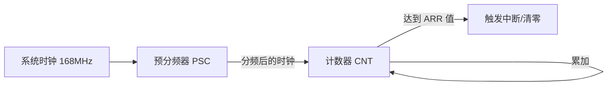
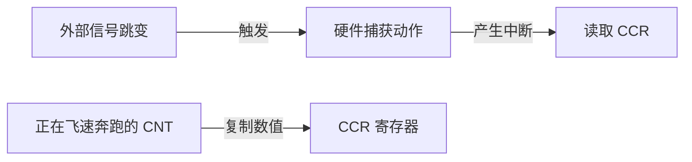
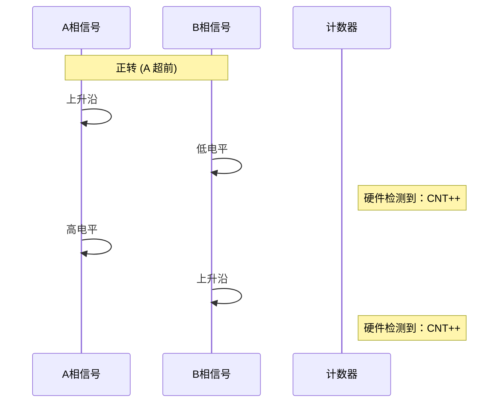
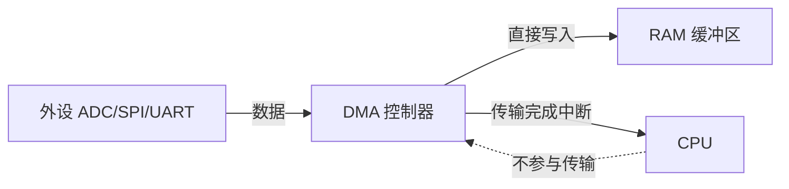
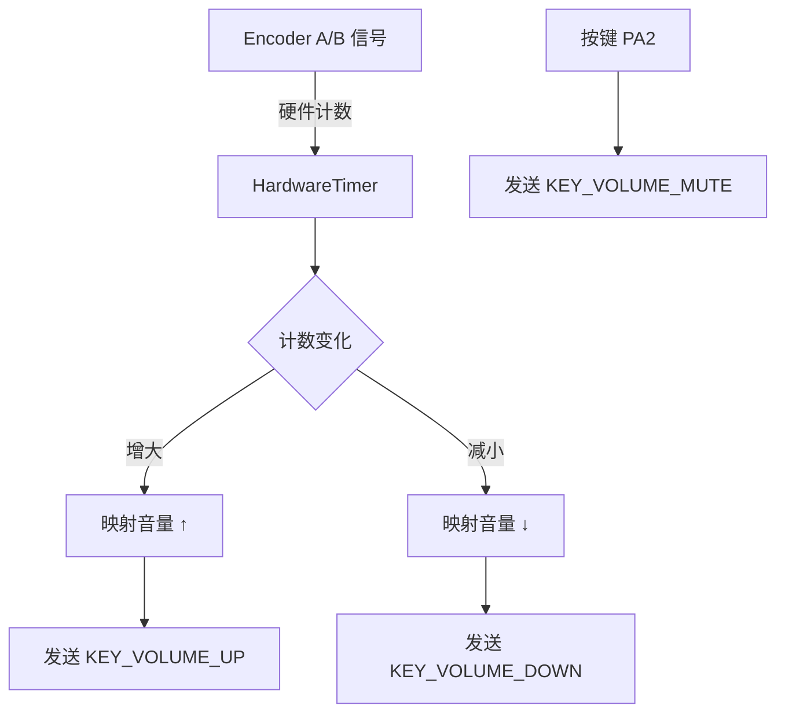

# STM32 大百科：用 Arduino 开启你的硬件魔法之旅 🚀

> 你好，年轻的探险家！欢迎来到电子世界的"动力核心"。这份指南将带你从零开始，深度探索 STM32 这个强大的硬件世界。我们不仅会教你如何写代码，还会告诉你每一个功能背后的"魔法原理"。

---

[TOC]

---


# 第一章：初识 STM32——你的超级智能大脑 🧠

## 1.1 STM32 是什么？

如果你玩过普通的 Arduino（比如 Uno），你可能已经知道如何让灯闪烁。但 **STM32** 是完全不同级别的：

- 🚀 **它是"学霸"**：运算速度比普通 Arduino 快 5 到 30 倍
- 🤚 **它有"多只手"**：有很多组串口、很多组定时器，可以同时做很多事
- 🎭 **它很"多面手"**：能假装成鼠标、键盘，甚至能播放音乐
- 💰 **它很"实惠"**：性能强大但价格亲民

## 1.2 实力大 PK：为什么选 STM32？

| 特性 | Arduino Uno (自行车) | STM32F103 (跑车) | STM32H7 (火箭) |
|:---|:---|:---|:---|
| **主频** | 16 MHz | 72 MHz | 480 MHz |
| **Flash** | 32 KB | 64-512 KB | 最高 2 MB |
| **RAM** | 2 KB | 20-128 KB | 最高 1 MB |
| **工作电压** | 5V | 3.3V | 3.3V |
| **串口数量** | 1 个 | 3-5 个 | 最多 10 个 |
| **ADC 精度** | 10 位 | 12 位 | 16 位 |
| **USB** | 无原生 | 支持 | 全速/高速 |

## 1.3 支持的 STM32 系列

STM32duino 支持超过 **500+ 种开发板**，涵盖几乎所有 STM32 系列：

| 系列 | 特点 | 典型型号 |
|------|------|----------|
| **STM32C0** | 入门级、低成本 | STM32C011 |
| **STM32F0** | 入门级 Cortex-M0 | STM32F030, F072 |
| **STM32F1** | 经典款、最常见 | STM32F103C8T6 (Blue Pill) |
| **STM32F4** | 高性能、浮点运算 | STM32F407, F411 (Black Pill) |
| **STM32F7** | 更高性能 | STM32F746, F767 |
| **STM32G0** | 新一代入门级 | STM32G030, G071 |
| **STM32G4** | 混合信号处理 | STM32G431, G474 |
| **STM32H7** | 超高性能、双核 | STM32H743, H747 |
| **STM32H5** | 新一代高性能、高安全性 | STM32H563, H573 |
| **STM32L0/L4/L5** | 超低功耗 | STM32L476, L552 |
| **STM32U5** | 最新超低功耗 | STM32U575, U585 |
| **STM32WB** | 蓝牙 + 主控二合一 | STM32WB55 |
| **STM32WL** | LoRa + 主控二合一 | STM32WL55 |

## 1.4 核心架构揭秘

STM32duino 基于三大组件构建：

```
┌─────────────────────────────────────────────────────┐
│                  你的 Arduino 代码                    │
├─────────────────────────────────────────────────────┤
│             Arduino API 兼容层 (STM32duino)          │
├─────────────────────────────────────────────────────┤
│     STM32Cube HAL/LL 库   │   CMSIS (ARM 标准接口)   │
├─────────────────────────────────────────────────────┤
│                    STM32 硬件                        │
└─────────────────────────────────────────────────────┘
```

- **HAL (硬件抽象层)**：标准化 API，让代码可以在不同 STM32 芯片间移植
- **LL (Low-Layer)**：轻量级 API，追求极致性能
- **CMSIS**：ARM 定义的标准接口，包含 DSP 数学库

---


# 第二章：开发环境与上传方式 📥

## 2.1 安装 STM32duino

1. 打开 Arduino IDE 2.x
2. 进入 **文件 → 首选项**
3. 在"附加开发板管理器网址"中添加：
   ```
   https://github.com/stm32duino/BoardManagerFiles/raw/main/package_stmicroelectronics_index.json
   ```
4. 打开 **工具 → 开发板 → 开发板管理器**
5. 搜索 "STM32" 并安装

> ⚠️ **注意**：自 Core 2.8.0 版本起，仅支持 Arduino IDE 2.x

## 2.2 常用上传代码的方式

写好代码后，我们需要把它"装进"芯片里。STM32 有几种常见的方法：

| 方式 | 优点 | 缺点 | 适用场景 |
|------|------|------|----------|
| **ST-Link** | 最强、可调试 | 需要购买调试器 | 专业开发 |
| **DFU (USB)** | 无需额外硬件 | 需进入 DFU 模式 | 快速烧录 |
| **串口 (UART)** | 简单易用 | 速度较慢 | 初学者/备用 |
| **J-Link / JTAG** | 专业强悍、极速 | 硬件昂贵 | 进阶开发/调试 |
| **CMSIS-DAP** | 开源、便宜、通用 | 官方IDE支持较弱 | PlatformIO/折腾党 |

### 详细上传方式说明

1. **ST-Link (推荐)**：不仅仅是下载器，还是强大的调试器。
   - **连接**：SWDIO, SWCLK, GND, 3.3V
   - **特点**：支持单步调试，速度快，不占用串口。

2. **DFU 模式 (USB 直接下载)**：利用芯片自带的 System Bootloader。
   
   > [!IMPORTANT]
   > **关键兼容性说明**：并非所有 STM32 都支持 USB DFU！请查阅下表：

   | 核心系列 | 型号子系列/说明 | 原生 (System) DFU? | 备注/典型例子 |
   | :--- | :--- | :---: | :--- |
   | **STM32F1** | F103 (主流) | ❌ **不支持** | 虽有 USB 硬件，但 ROM 代码不支持 DFU。<br>**必须**先用 ST-Link 刷第三方 Bootloader。 |
   | | F105, F107 (互联型) | ✅ **支持** | 自带 USB OTG 模块，ROM 支持 DFU。 |
   | **STM32F0** | F030, F051, F091 | ❌ **不支持** | 入门型无 USB 或 Bootloader 不支持。 |
   | | F042, F070, F072, F098 | ✅ **支持** | 带 USB 外设的型号 (含 F070x6/xB, F098) 原生支持。 |
   | **STM32L0** | L01x, L03x, L05x | ❌ **不支持** | |
   | | L052, L072, L082 | ✅ **支持** | 尾号 x2/x3 等带 USB 的型号。 |
   | **STM32L1** | 多数型号 (如 L151/152) | ✅ **支持** | 早期 L151x6/8/B 除外。 |
   | **STM32F2** | 全系列 | ✅ **支持** | 自带 Bootloader **V3.x** 以上支持 DFU。<br>(注：极早期 A/Z/B 版本仅支持串口) |
   | **STM32F3** | F302/F303/F373 | ✅ **支持** | **全系支持** (含 Nucleo-32 的 K8)。 |
   | **STM32F4** | F401, F405, F407, F411... | ✅ **支持** | **全系支持** (F410除外)。BlackPill 首选。 |
   | **STM32F7/H7** | 全系列 | ✅ **支持** | 高端系列标配。 |
   | **STM32G0** | G030/031/041 | ❌ **不支持** | |
   | | G0B1/C1 等 | ✅ **支持** | 带 USB 模块的 G0 型号支持。 |
   | **STM32G4** | G431, G474 | ✅ **支持** | ST 主要推崇的 F3/F1替代者。 |
   | **STM32L4/L5** | 全系列 | ✅ **支持** | 低功耗高性能系列标配。 |
   | **STM32WB/WL** | 全系列 | ✅ **支持** | 无线系列支持。 |
   | **STM32U5/U3** | 全系列 | ✅ **支持** | 超低功耗 M33 内核系列均支持。 |
   | **STM32WBA/WB0** | 全系列 | ✅ **支持** | 新一代无线系列 (BLE) 均支持。 |
   | **STM32C0/U0** | 带 USB 型号 | ✅ **支持** | C0/U0 部分高端型号 (如 C071/U083) 带 USB 则支持。 |

   > [!NOTE]
   > **免责声明**：以上信息整理自 AN2606，仅供参考。芯片的 Bootloader 版本可能随生产批次更新，实际支持情况请以 **ST 官方最新文档 (AN2606)** 为准。

   - **DFU 模式的进入方式**：
     *   **支持工具**：**所有 DFU 工具** (STM32CubeProgrammer, dfu-util 等)。只要设备进入了 DFU 模式，任何能认出它的工具都能烧录。
     *   **前提**：所选芯片内核bootloader支持USB DFU模式, 电脑有支持的下载功能(如STM32CubeProgrammer，dfu-util)并且已安装相应的驱动。
     *   **操作**：
         1. **按住 BOOT0 键** (或将 BOOT0 引脚拉高到 3.3V)。
         2. 重新上电或按一下 **NRST (Reset)** 键。
         3. **松开 BOOT0 键**。
         4. 此时电脑设备管理器应出现 "STM32 BOOTLOADER" 。

3. **串口下载 (Serial)**：F103 的救星。
   - **连接**：USB转TTL模块 (RX->PA9, TX->PA10)。
   - **进入方式**：同上 (BOOT0=1, BOOT1=0)。这是 F103 出厂自带的最可靠下载方式。
   
4. **J-Link / JTAG (专业调试器)**：
   - **适用**：拥有正版/克隆版 J-Link 的用户。
   - **配置**：在菜单 **Upload method** 中选择 `STM32CubeProgrammer (SWD)` (推荐) 或 `JLink`。
   - **优势**：速度极快，支持断点调试 (需配合 OpenOCD/GDB)。
   - **连接**：SWD 模式下连线与 ST-Link 相同 (SWCLK, SWDIO, GND, 3.3V)。

5. **CMSIS-DAP / DAPLink (开源调试器)**：
   - **现状**：STM32duino 官方 Arduino 菜单**尚未原生支持**直接选择 CMSIS-DAP。
   - **替代方案**：
     *   **PlatformIO**：完美支持 (`upload_protocol = cmsis-dap`)。
     *   **Arduino IDE**：需手动修改配置调用 OpenOCD，或使用 HID Bootloader 等变通方案。
   - **结论**：虽然硬件很便宜好用，但在 Arduino IDE 下不如 ST-Link 方便。

---

### 2.3 专题：如何让 F103 (BluePill) 支持 USB 下载？
对于不支持原生 DFU 的 **STM32F103** 系列，如果不想每次都插串口模块，也不想用 ST-Link，可以通过**"一次性刷写第三方 Bootloader"** 的方式，让它获得 USB 下载能力。

1.  **准备工具**：
    *   **ST-Link V2** 或 **USB转TTL** 模块（仅第一次刷写 Bootloader 时需要）。
    *   软件：**STM32CubeProgrammer**。
    *   固件：**STM32duino Bootloader** (通常使用 `generic_boot20_pc13.bin`，对应 BluePill 的 PC13 LED)。
        *   *下载地址推荐参考 rogersclark/stm32duino-bootloader 仓库*。

2.  **刷写步骤 (以 ST-Link 为例)**：
    1.  ST-Link 连接板子的 SWD 接口 (GND, 3.3V, SWCLK, SWDIO)。
    2.  打开 STM32CubeProgrammer，连接芯片。
    3.  点击 "Open File" 选择下载好的 `.bin` 固件。
    4.  地址设为 `0x08000000` (默认起始地址)，点击 **Download**。
    5.  刷写成功后，拔掉 ST-Link。

3.  **使用方法**：
    1.  **连接 USB**：直接用 MicroUSB 线将板子连上电脑。
    2.  **安装驱动**：此时电脑会识别到一个新设备（通常叫 `Maple 003` 或类似）。
        *   **关键**：依然需要用 **Zadig**，此时列表里会出现 `Maple 003`，给它安装 **WinUSB** 或 `libusb-win32` 驱动。
    3.  **IDE 设置**：
        *   **Upload method** 选择：`STM32duino bootloader`。
    4.  **上传**：点击上传，Bootloader 会自动通过 USB 接收程序（无需手动按 BOOT0）。
        *   *原理：Bootloader 会在复位后短暂等待 USB 信号，IDE 会发指令让它复位进入这个模式。*

> [!WARNING]
> **副作用**：刷入 Bootloader 后，你的 Flash 空间会少几 KB（被 Bootloader 占用了）。且每次上电都会先运行 Bootloader，导致启动会有轻微延迟。若程序跑飞，按 Reset 键即可救回。

> [!TIP]
> **安装秘籍**：在"附加开发板管理器网址"添加官方 JSON 后，由于 GitHub 加速问题，下载可能会卡住。建议保持良好的网络连接。

## 2.4 PlatformIO DFU 配置 (可选)

如果你使用 VS Code + PlatformIO 开发，启用 DFU 同样简单。在 `platformio.ini` 中添加：

```ini
[env:genericSTM32F103C8]
platform = ststm32
board = genericSTM32F103C8
framework = arduino
upload_protocol = dfu
```

**关键点**：
- **upload_protocol = dfu**：这一行告诉 PIO 自动下载并使用 `dfu-util` 工具。
- **驱动 (仅 Windows)**：PlatformIO 会自动下载上传工具，但**不会**自动安装 Windows 设备驱动。你必须使用 **Zadig** 工具将 "STM32 BOOTLOADER" 的驱动强制替换为 `WinUSB`，否则 `dfu-util` 无法找到设备。

## 2.5 PlatformIO 进阶：配置全片擦除 vs 扇区擦除

默认情况下，PlatformIO (OpenOCD) 采用**扇区擦除 (Sector Erase)**，即只擦除代码占用的区域，保留其他区域（如模拟 EEPROM 数据）。这比全片擦除快，也更安全。

如果你希望像 Keil 那样进行**全片擦除 (Full Chip Erase)**（例如为了彻底清除旧配置），有几种方法：

### 方法一：通过 `upload_flags` (最简单)
在 `platformio.ini` 中添加 OpenOCD 指令。
*(注意：不同上传协议指令略有不同，以下以 ST-Link 为例)*

```ini
[env:genericSTM32F103C8]
upload_protocol = stlink
; 添加全片擦除指令 (仅 OpenOCD 有效)
upload_flags = 
    -c
    transport select hla_swd
    -c
    init
    -c
    reset halt
    -c
    stm32f1x mass_erase 0
    -c
    reset
```

### 方法二：使用 CLI 命令 (临时使用)
如果你只是偶尔需要全片擦除，不需要改配置，直接在 VS Code 终端运行：

```bash
pio run --target erase
```
这会调用 `platform-ststm32` 的擦除任务，执行全片擦除。之后再正常上传即可。

### ⚠️ 注意：串口下载 (Serial) 的特殊情况
上述配置仅适用于 **OpenOCD** (如 ST-Link, J-Link, CMSIS-DAP)。
如果你使用的是 **串口下载 (`upload_protocol = serial`)**：
*   ❌ **不可用**：上面的 OpenOCD `upload_flags` 会导致报错。
*   ✅ **默认行为**：串口下载工具 (`stm32flash`) 默认会自动擦除即将在写入数据的扇区。
    *   **关于工具缺失**：如果你在 `.platformio\packages` 下找不到 `tool-stm32flash`，是因为你**还没有执行过一次串口上传**。PlatformIO 是按需下载的。请尝试先在 `platformio.ini` 中设置 `upload_protocol = serial` 并执行一次上传（即使失败也会下载工具）。
    *   **命令示例**：
    ```bash
    # 进入工具目录后运行
    ./stm32flash.exe -o COM5
    ```

    > [!NOTE]
    > **PlatformIO 串口配置参考**：
    > 虽然 `upload_protocol = serial` 就能触发工具下载，但为了确保上传成功，通常建议在 `platformio.ini` 中指定端口和波特率：
    > ```ini
    > [env:serial_upload]
    > upload_protocol = serial
    > upload_port = COM5       ; 必填，指定串口号
    > upload_speed = 115200    ; 选填，默认通常是 115200
    > ```

### 2.6 DFU 模式下的全片擦除
如果你使用 **USB DFU** (`upload_protocol = dfu`)，底层工具是 `dfu-util`。

*   **自动擦除**：同样，默认会自动擦除所需扇区。
*   **全片擦除 (Mass Erase)**：
    *   **方法一 (推荐 - STM32CubeProgrammer)**：官方工具最稳定。
        ```bash
        STM32_Programmer_CLI -c port=usb1 -e all
        ```
    *   **方法二 (dfu-util 高级指令)**：
        *(这是需手动在终端运行的命令，并非 ini 配置)*
        ```bash
        # 尝试使用特殊修饰符 (视芯片 Bootloader 版本而定，不一定成功)
        dfu-util -a 0 -s :mass-erase:force -D dummy.bin
        ```
        *(注意：`dummy.bin` 是一个任意存在的空文件，用于骗过命令参数检查)*

> [!TIP]
> **什么时候需要全片擦除？**
> *   当你的程序莫名其妙跑飞，怀疑 Flash 里有脏数据干扰时。
> *   当你启用了读保护 (RDP) 想要解锁芯片时（全片擦除会自动清除读保护，前提是未设为最高等级）。

## 2.7 PlatformIO 核心配置详解：lib_deps 与 build_flags

在 STM32duino 的进阶开发中，你会频繁接触 `platformio.ini` 中的这两个选项。它们一个是管理“外援”（库），一个是设置“开关”（宏定义）。

### 1. lib_deps：库依赖管理
这是 PlatformIO 的灵魂。它不仅会自动下载库，还会管理库的版本。

**常用语法示例：**
```ini
lib_deps =
    ; 1. 官方仓库库名 @ 版本 (推荐)
    stm32duino/STM32duino RTC @ ^1.4.0
    
    ; 2. 指定特定的 Git 链接
    https://github.com/stm32duino/STM32SD.git
    
    ; 3. 本地路径 (用于开发自己的库)
    symlink://C:/vender/MyLocalLib
```

**版本号规则说明：**
*   **`^1.4.0`** (推荐)：兼容版本。允许更新到 `1.x.x`，但不会跨越到 `2.0.0`。保证了代码的稳定性。
*   **`~1.4.0`**：更保守。只允许更新补丁版本（如 `1.4.1`），不允许更新到 `1.5.0`。
*   **`@ 1.4.0`**：锁定版本。永远只用这一个版本。

> [!TIP]
> **库去哪了？**
> 下载的库存放在项目根目录的 `.pio/libdeps/开发板名/` 下。如果你觉得库文件有问题，直接删掉这个文件夹，重新编译即可触发重新下载。

> [!IMPORTANT]
> **库名与“注册表延迟” (Registry Latency)**
> 为什么有时候 `stm32duino/STM32duino FatFs` 这样的库名会报错？
> 1.  **名称不匹配**：PlatformIO 注册表对名称极度敏感。虽然 GitHub 叫这个名字，但注册表里可能叫 `stm32duino/FatFs`。
> 2.  **版本滞后**：官方（如 ST）更新 GitHub 释出新版本（如 v4.0.0）后，可能需要几天甚至更久才会同步到 PlatformIO 注册表。
> **解决方法**：如果你急需最新版或注册表报错，**直接指定 GitHub 链接**（如 `https://github.com/stm32duino/FatFs.git`）。Git 链接永远指向源码，不会有注册表更新延迟。

> [!TIP]
> **哪里才是“官方”支持的最高版本？**
> 当你在搜索库遇到困惑时，请遵循以下查询顺序：
> 1.  **首选 (Source of Truth)**：[STM32duino GitHub Organization](https://github.com/stm32duino)。在这里搜索库名（如 `FatFs`），进入仓库查看 **Releases** 标签或查看 `library.properties` 文件中的 `version` 字段。这永远是最权威、最新的。
> 2.  **次选**：[STM32duino 官方 Wiki](https://github.com/stm32duino/Arduino_Core_STM32/wiki/Associated-libraries)。这里列出了所有经过官方测试兼容的关联库。
> 3.  **末选**：PlatformIO Registry 网站。仅作为快速引用的参考，不要完全依赖它的版本显示。

> [!TIP]
> **如何查看 PlatformIO 注册表里“已有”的最新版？**
> 如果你想知道 PIO 此时此刻到底支持哪个版本（从而决定是否需要用 Git 链接），可以：
> 1.  **命令行 (推荐)**：
>     *   如果你**不知道精确 ID**：先用 `pio pkg search "库名"` 进行模糊搜索，找到结果后记录其 ID（如 `stm32duino/FatFs`）。
>     *   如果你**已知精确 ID**：运行 `pio pkg show "ID"`。**注意：** `show` 指令不支持模糊查找，必须 ID 完全一致。
> 2.  **Web 网页**：访问 [registry.platformio.org](https://registry.platformio.org/)，搜索库名并点击进入，可以查看对应的版本列表。
> 3.  **VSCode 插件**：点击左侧图标进入 PIO Home -> Libraries -> 搜索库 -> 点击库名查看版本。

> [!CAUTION]
> **搜不到？名字对不上？—— 终极排查指南**
> 如果你发现 `pio pkg search` 返回了一堆垃圾信息，或者你自认为对的名字（如 `stm32duino/STM32duino FatFs`）搜不出来：
> 1.  **看 `library.properties`**：去 GitHub 仓库根目录，打开这个文件。里面的 `name=` 字段通常就是注册表里承认的“官方 ID”。
> 2.  **关键字搜索**：不要搜索长路径。如果你搜 `stm32duino/STM32duino FatFs` 失败，请尝试只搜 `FatFs`。
> 3.  **“核武器”方案 (终极手段)**：如果你在搜库上浪费了超过 1 分钟，请立刻停止。**直接复制 GitHub 库的 HTTPS 链接**（如 `https://github.com/stm32duino/FatFs.git`）填入 `lib_deps`。
>     *   👉 **优点**：100% 成功，版本最新，无需纠结注册表 ID 是什么。
>     *   👉 **缺点**：离线环境下无法更新（但注册表同样不行）。

---

### 2. build_flags：编译标志（预处理宏）
这通常用于向编译器传递特定的参数。在 STM32 中，它最核心的作用是**开启硬件功能的开关**。

**典型用法：**
*   **`-D MACRO_NAME`**：定义一个全局宏。
*   **`-I dir`**：添加头文件搜索路径。

**为什么 STM32 必须用它？**
STM32 芯片外设极其丰富（很多串口、很多定时器），为了减小生成的代码体积，核心库默认**关闭**了许多大型模块。你必须通过 `build_flags` 显式“告知”编译器：
*   `-D HAL_SD_MODULE_ENABLED`：开启硬件 SD 卡驱动。
*   `-D HAL_DAC_MODULE_ENABLED`：开启 DAC 硬件驱动。

**实战配置示例：**
```ini
build_flags =
    -D HAL_SD_MODULE_ENABLED    ; 开启 SDHI/SDMMC 支持
    -D USBCON                   ; 开启原生 USB 串口 (Serial)
    -D USBD_VID=0x0483          ; 自定义 USB 厂商 ID
    -I include                  ; 让编译器去 include 文件夹找头文件
```

> [!WARNING]
> **语法坑**：每一行配置前必须有 **缩进**，且多个标志必须分行写或空格隔开。如果写错，编译器将无法识别对应的标志。

> [!NOTE]
> **警告：Redefined 标志**
> 某些开发板（如 Black F407ZG）的官方定义文件中已经预先开启了某些模块（如 `HAL_SD_MODULE_ENABLED`）。如果你在编译时看到一大串 `warning: "..." redefined`，说明你的 `build_flags` 与板级定义重复了。这时可以放心地从 `platformio.ini` 中删掉重复的行。


---


# 第三章：基础交互接口——GPIO 与外部中断 ⚙️

GPIO（通用输入输出）是你对硬件下达指令的首要方式。

### 3.1 引脚模式深度解析
- **`INPUT_PULLUP`**：内部通过电阻拉到 3.3V。适合接按钮，按下时为 `LOW`。
- **`OUTPUT_OPEN_DRAIN`**：开漏输出。它像一个开关，只能“吸入”电流或不动作。常用于 I2C 或不同电压间的电平转换。

#### 3.1.1 实战演练：基础 GPIO 控制 (轮询法)
这是最简单的交互方式：如果你想知道门口有没有人（按键按下），你就每隔几秒去开门看一眼（轮询）。

**硬件连接**：
- **PA15**：连接按键的一端，按键另一端接 GND（利用内部上拉，按下为 LOW）。
- **PC13**：连接 LED（大多数板载 LED 为 PC13，低电平点亮）。

```cpp
#include <Arduino.h>

// 定义引脚别名，使代码更易读
const int BUTTON_PIN = PA15;
const int LED_PIN    = PC13;

void setup() {
  Serial.begin(115200);
  
  // 1. 配置按键为输入，启用内部上拉电阻
  // 这样当按键未按下时读到 HIGH，按下接地变 LOW
  pinMode(BUTTON_PIN, INPUT_PULLUP);
  
  // 2. 配置 LED 为输出
  pinMode(LED_PIN, OUTPUT);
}

void loop() {
  // 读取当前按键状态
  int buttonState = digitalRead(BUTTON_PIN);

  // 如果按键按下 (LOW)
  if (buttonState == LOW) {
    digitalWrite(LED_PIN, LOW); // 点亮 LED (假设低电平点亮)
  } else {
    digitalWrite(LED_PIN, HIGH); // 熄灭 LED
  }
  
  delay(10); // 简单的消抖延时
}
```

### 3.2 外部中断 (EXTI)：闪电反应
如果你的代码正在处理繁忙的任务，突然有个紧急按钮被按下，STM32 可以在纳秒级时间中断当前任务去处理它！

#### 实战演练：按键中断控制 LED (非阻塞)
轮询法虽然简单，但 CPU 必须一直"盯着"引脚看。如果用中断，CPU 可以去忙别的（比如算圆周率），按键按下时只要"戳"一下 CPU 即可。

**场景**：平时 LED 熄灭，当 PA15 按下（下降沿）时，触发中断点亮/翻转 LED。

```cpp
#include <Arduino.h>

// 定义硬件引脚
const int BUTTON_PIN = PA15;
const int LED_PIN    = PC13;

// 关键点：中断中修改的变量必须加 volatile，防止编译器优化
volatile bool buttonPressed = false;

// 中断回调函数 (ISR)
// ⚠️ 注意：ISR 必须极快，绝不要使用 Serial.print 或 delay()
void onButtonPress() {
  buttonPressed = true; // 仅置标志位，快速退出
}

void setup() {
  Serial.begin(115200);
  pinMode(LED_PIN, OUTPUT);
  pinMode(BUTTON_PIN, INPUT_PULLUP); // 必须配置输入模式（通常带上拉）
  
  // 配置中断：当下降沿 (按下) 触发
  attachInterrupt(digitalPinToInterrupt(BUTTON_PIN), onButtonPress, FALLING);
}

void loop() {
  // 在主循环中安全处理逻辑
  if (buttonPressed) {
    Serial.println("PA15 Pressed!");
    digitalToggle(LED_PIN); // STM32 特有便捷函数：翻转电平
    
    buttonPressed = false; // 清除标志
  }
  
  // 模拟耗时任务 (仅作反面教材演示)
  // delay(1000); 
}
```

> ⚠️ **注意**：中断回调应保持简短，避免使用 `delay()`、`Serial.print()` 等阻塞操作。若需复杂处理，请在 `loop()` 中完成。

#### NVIC 配置与优先级
`attachInterrupt()` 默认使用最低优先级（通常为 15）。如果你希望按键中断能打断其他中断（比如定时器），或者不被其他中断打断，可以手动提高它的优先级。

**优先级规则**：数值越小，优先级越高（0 为最高，15 为最低）。

```cpp
#include <Arduino.h>

const int LED_PIN = PC13;
volatile bool buttonPressed = false;

// 中断回调
void onButtonPress() {
  buttonPressed = true;
}

void setup() {
  Serial.begin(115200);
  pinMode(PA15, INPUT_PULLUP);
  pinMode(LED_PIN, OUTPUT);
  
  // 1. 先绑定中断
  attachInterrupt(digitalPinToInterrupt(PA15), onButtonPress, FALLING);
  
  // 2. 获取 PA15 对应的中断号 (IRQn)
  
  // PA15 对应 EXTI15_10_IRQn (外部中断线 10-15 共用)
  // stm32duino 提供了便捷函数：digitalPinToInterrupt(pin) 返回的是中断号
  IRQn_Type irq = (IRQn_Type)digitalPinToInterrupt(PA15);

  // 3. 设置最高优先级 (0)
  // 优先级范围: 0 (最高) - 15 (最低)
  HAL_NVIC_SetPriority(irq, 0, 0); 
  // 或者: HAL_NVIC_SetPriority(EXTI15_10_IRQn, 0, 0);
  
  Serial.println("PA15 中断优先级已设为最高 (0)");
}

void loop() {
  if (buttonPressed) {
    Serial.println("High Priority Interrupt Triggered!");
    digitalToggle(LED_PIN);
    buttonPressed = false;
  }
}
```

> [!TIP]
> **为什么要用 HAL 函数？**
> 你可能在后文看到 `HardwareTimer` 类提供了便捷的 `setInterruptPriority` 封装。但对于外部中断 (EXTI)，Arduino 核心目前**没有**提供类似的全局封装函数来设置优先级。因此，直接调用底层的 `HAL_NVIC_SetPriority` 是修改外部中断优先级的标准做法。


> [!NOTE]
> STM32 的外部中断线是分组的：
> *   Line 0-4：每个引脚有独立的中断向量 (EXTI0_IRQn ... EXTI4_IRQn)
> *   Line 5-9：共用一个中断向量 (EXTI9_5_IRQn)
> *   Line 10-15：共用一个中断向量 (EXTI15_10_IRQn) -> **PA15 用这个**


#### 常见问题
- **抖动**：使用硬件或软件去抖（通常情况下按键机械抖动是ms级的，所以可以忽略短时间内的多次抖动触发）。
- **未触发**：确认引脚支持 EXTI（STM32 大多数 GPIO 都支持），并检查上拉/下拉电阻配置。

> [!TIP]
> **想要更精准的控制？**
> 外部中断主要用于"捕捉瞬间发生"的事件。如果你需要每隔固定时间（如 10ms）检查一次按键状态（甚至进行软件消抖），或者你的主循环里有大量延时操作或其他任务，强烈建议使用 **硬件定时器**。
> 👉 请跳转阅读 [第五章：硬件定时器](#第五章时间律动硬件定时器-hardwaretimer-)，学习如何让代码在后台自动运行，完全不受 `delay()` 影响！


# 第四章：模拟世界——ADC、DAC 与信号转换 🔍

现实世界是模拟的（电压缓缓变化），代码世界是数字的（只有 0 和 1）。

### 4.1 ADC 魔法点燃：12 位精度
STM32 将 0~3.3V 切成了 **4096** 份，比 Uno 的 1024 份精细得多。

> [!WARNING]
> 为了获得最准的数据，建议先调用 `analogReadResolution(12)`。

**ADC 分辨率选项**：
- `analogReadResolution(10)` - 10 位，0-1023（兼容 Arduino Uno）
- `analogReadResolution(12)` - 12 位，0-4095（大多数 STM32 默认）
- `analogReadResolution(16)` - 16 位，0-65535（仅 STM32H7 等高端型号支持）

```cpp
#include <Arduino.h>

void setup() {
  analogReadResolution(12); // 设置为 12 位分辨率
}

void loop() {
  int val = analogRead(PA0); // 读取 0-4095 的值
}
```

### 4.2 内部自检：不用接线也能测
STM32 内部自带三个隐藏通道：
1. **`ATEMP`**：测量芯片自己热不热。
2. **`AVREF`**：测量内部参考电压，哪怕你的电池电压波动，它也能帮你算准电压。

```cpp
#include <Arduino.h>

void setup() {
  Serial.begin(115200);
  analogReadResolution(12); // 12位精度
}

void loop() {
  // 读取内部温度传感器
  int tempRaw = analogRead(ATEMP);
  // 转换为温度（公式因芯片而异，请查看数据手册）
  float temperature = ((float)tempRaw * 3.3 / 4095 - 0.76) / 0.0025 + 25;
  Serial.print("芯片温度: ");
  Serial.print(temperature);
  Serial.println("°C");
  
  // 读取内部参考电压
  int vrefRaw = analogRead(AVREF);
  float vref = (float)vrefRaw * 3.3 / 4095;
  Serial.print("内部参考电压: ");
  Serial.println(vref);
  
  delay(1000);
}
```

### 4.3 模拟输出 (Part 1): PWM —— 模拟电压的“替身”

在 Arduino 世界里，`analogWrite` 是输出模拟信号的通用接口。但这只是一个统一的 API 外壳。
对于大多数引脚（以及大多数单片机）而言，它们并不能输出真正连续变化的 0~3.3V 电压。当你调用 `analogWrite` 时，它幕后使用的是 **PWM (脉冲宽度调制)** 技术。

*   **原理**：通过极快地开关引脚（例如 1kHz 或 20kHz），调整高电平(3.3V)在每个周期内占据的时间比例（占空比）。
*   **效果**：当接上 LED 时，人眼会感觉到亮度变化；当接上电机时，惯性会平滑掉开关动作；当接上电容滤波电路时，它就能变成真正的直流电压。
*   **通用性**：几乎所有支持 PWM 的引脚（通常有波浪号 ~ 标记）都能使用此功能。

STM32 允许你调整 PWM 的频率和精度。默认设置是为了兼容 Arduino Uno，但你可以做得更好：

```cpp
#include <Arduino.h>

void setup() {
  // 全局配置 (无需指定引脚，对所有后续 analogWrite 生效)
  analogWriteFrequency(20000); // 设置 PWM 频率为 20kHz
  analogWriteResolution(12);   // 设置 PWM 分辨率为 12位 (0-4095)

  // 必须调用 analogWrite 才会真正输出波形
  analogWrite(PA0, 2048);      // 在 PA0 输出 50% 占空比 (4096 / 2 = 2048)
}

void loop() {}
```

### 4.4 模拟输出 (Part 2): DAC —— 真实的电压发生器

与 PWM “欺骗眼睛/耳朵”的模拟方式不同，部分高端 STM32 芯片拥有 **DAC (数模转换器)**，能输出**真正的、纯净的直流电压**。

*   **特点**：输出的是一条平滑的直线，而不是开关方波。
*   **限制**：只有特定的引脚（通常是 PA4, PA5）才具备此功能，且并非所有型号都支持（见下文表格）。
*   **调用**：**依然是 `analogWrite`**！核心库会自动识别：如果该引脚支持 DAC，它就输出真电压；否则就回退到 PWM。

```cpp
#include <Arduino.h>

void setup() {
  // DAC 输出引脚通常为 PA4 (DAC1) 或 PA5 (DAC2)
  pinMode(PA4, OUTPUT); //虽然 analogWrite 会自动配置，但显式设置是个好习惯
}

void loop() {
  // 12位 DAC: 0-4095 对应 0-3.3V
  analogWrite(PA4, 2048);  // 输出约 1.65V (中间值)
  delay(500);
  
  analogWrite(PA4, 4095);  // 输出约 3.3V
  delay(500);
  
  analogWrite(PA4, 0);     // 输出 0V
  delay(500);
}

```

> [!IMPORTANT]
> **DAC 芯片兼容性**：
> - **STM32F1 系列**：**分型号支持**。
>     - **支持**：大容量 (High-density) 型号 (如 F103RC, F103ZE, F105, F107) **带 DAC**。
>     - **不支持**：中小容量型号 (如最常见的 **F103C8T6**, C6) **不带 DAC**。
> - **STM32F4 系列**：
>     - **支持**：F405, F407, F429 等高性能型号 (通常 2个通道)。
>     - **不支持**：F401, F411 等入门型号。
> - **STM32G0 系列**：
>     - **支持**：G071, G081 等 Access Line。
>     - **不支持**：**G030, G031** 等 Value Line (最便宜的型号)。
> - **STM32F3 / G4 / H7 / L4 系列**：作为混合信号或高性能 MCU，**绝大多数型号标配 DAC**。
> - **STM32F0 系列**：部分型号支持 (如 F05x, F07x)，入门级 (F030) 不支持。
>
> **关键建议**：不要猜测！请务必查阅芯片 DataSheet 内容进行确认！

> [!NOTE]
> **analogWrite 的本质**：
> 绝大多数标准 Arduino（如 Uno R3, Nano）都**没有 DAC**，它们的 `analogWrite()` 实际上产生的也是 **PWM 方波**（利用数字快速开关来“假装”模拟电压）。
> *   **相同点**：STM32F103C8T6 和 Arduino Uno 一样，只能输出 PWM。
> *   **不同点**：部分高端 STM32（如 F407, G4）内置了**真正的 DAC**。在这些芯片的特定引脚上调用 `analogWrite()`，输出的是**纯净的直流模拟电压**（一条直线），而非方波。可以根据ST官方数据手册确认使用的芯片是否支持DAC功能以及DAC引脚位置。

> [!TIP]
> **默认精度与 PWM 的意义**：
> *   STM32duino 默认 `analogWriteResolution` 为 **8 位 (0-255)**，这是为了兼容标准 Arduino 代码。
> *   **对于没有 DAC 的芯片 (利用 PWM)**：提高分辨率（如 12 位）意味着调节占空比的步进更精细。
>     *   8位：只能把 0-100% 的亮度分成 256 级。
>     *   12位：能把它分成 4096 级，可以实现超级平滑的 LED 呼吸灯效果，或者更精准的电机调速。

### 4.5 深入探索：analogWrite 的双重身份 (DAC vs PWM)

有同学可能会问：*“如果我有 DAC 芯片但没用 DAC 引脚会怎样？”* 或者 *“我能自己写 HAL 函数吗？”* 这里统一解答：

1.  **analogWrite() 的智能回退机制**：
    STM32duino 的内核源码 (`wiring_analog.c`) 非常智能，它在执行时会按以下顺序判断：
    *   **判定1 (DAC)**：这是 DAC 引脚吗？如果是，输出真正模拟电压。
    *   **判定2 (PWM)**：不是 DAC？那它是定时器引脚吗？如果是，配置定时器输出 PWM 方波。
    *   **判定3 (GPIO)**：都不是？那就当作普通 `digitalWrite`，大于 50% 占空比输出高电平，否则低电平。(不会报错，但也没有 PWM 效果)
    *(注：标准 Arduino AVR 在非 PWM 引脚上也是类似行为：< 128 输出 LOW，>= 128 输出 HIGH)*

2.  **想要修改 PWM 频率或精度？**
    如果您确认使用的是 PWM 模式（且需要修改默认的 1kHz 频率或 8位精度），这些属于**高级定时器操作**。
    👉 **请直接跳转阅读 [4.3 模拟输出 (Part 1): PWM](#43-模拟输出-part-1-pwm--模拟电压的替身)**，那里有关于 `analogWriteFrequency` 的说明。

3.  **自定义 HAL 函数的风险**：
    *   **原则**：可以在 Arduino 代码中直接调用 `HAL_TIM_PWM_Start` 等函数，从语法上是完全支持的。
    *   **风险**：**极高！** Arduino 核心（HardwareTimer 等）会在后台自动管理时钟、中断和配置。如果你手动用 HAL 修改了寄存器，可能会和内核的管理逻辑冲突（例如内核以为时钟开了，你把它关了），导致程序崩溃或行为异常。
    *   **建议**：除非通过 HardwareTimer 无法实现该功能，否则**尽量避免裸写 HAL**。如果必须写，请确保你完全理解该外设的寄存器状态，以及你代码意图和内核的逻辑不冲突。

### 4.6 进阶答疑：当 DAC 遇上 PWM，谁说了算？

有同学问：*“如果我配置了 `analogWriteFrequency`，但在一个既有 DAC 又有 PWM 的引脚（如 STM32F407 的 PA5）上调用 `analogWrite`，会发生什么？”*

答案是：**DAC 拥有绝对优先权。**

1.  **优先级规则**：`analogWrite` 的内部判断逻辑是死板的：
    *   **Prior 1**: 只要该引脚在芯片的 DAC 列表中（且开启了 DAC 模块），它**一定**会以 DAC 模式输出模拟电压。
    *   **Prior 2**: 只有当引脚**不是** DAC 引脚时，它才会去尝试使用定时器 PWM。

2.  **设置的影响**：
    *   `analogWriteResolution(12)`：**有效**。它会改变 DAC 输出的精度级数 (0-4095)。
    *   `analogWriteFrequency(20000)`：**无效**。虽然函数调用成功，代码里也确实改了定时器频率，但因为引脚工作在 DAC 模式（输出直流电），所以你根本看不到 PWM 波形，这个设置在 DAC 模式下没有任何视觉效果。

3.  **特殊案例 (STM32F407)**：
    *   **PA4**：它是 DAC1_OUT，但它**没有**连接到任何定时器的输出通道。所以在 PA4 上你**永远无法**直接通过 `analogWrite` 得到硬件 PWM。
    *   **PA5**：它是 DAC2_OUT，同时也是 TIM2_CH1。
        *   默认调用 `analogWrite(PA5, ...)` -> **输出 DAC 电压**。
        *   如果你**非要**在 PA5 上输出 PWM，你不能用 standard `analogWrite`，必须使用 **HardwareTimer** 库强制配置 TIM2_CH1，绕过 `analogWrite` 的自动判断逻辑。


---


# 第五章：时间律动——硬件定时器 HardwareTimer 💓

HardwareTimer 是 STM32duino 最强大的特色功能之一！它封装了 STM32 复杂的定时器配置，使其像 Arduino API 一样简单，但功能依然强大。

### 5.0 基础时间函数：delay 与 millis

在使用硬件定时器之前，我们需要先掌握 Arduino 核心的两个时间概念：**阻塞 (Blocking)** 与 **非阻塞 (Non-blocking)**。

*   **`delay(ms)`**：阻塞式延时。相当于**"睡觉"**。在延时期间，CPU 暂停工作，无法响应按键或执行其他任务。
*   **`millis()`**：系统运行时间。相当于**"看手表"**。它返回自芯片启动以来的毫秒数，不会阻塞系统的运行。

#### 阻塞写法 (使用 delay)
像一个只会做一件事的工人，干完活就睡觉，睡醒了再干活。睡着的时候别人叫不醒他。

```cpp
#include <Arduino.h>

// 如果你在 delay(1000) 期间按下按键，CPU 根本不知道！
void setup() { 
  pinMode(PC13, OUTPUT); 
}

void loop() {
  digitalWrite(PC13, HIGH);
  delay(1000); // 死等 1秒
  digitalWrite(PC13, LOW);
  delay(1000); // 死等 1秒
}
```

#### 非阻塞写法 (使用 millis)
像一个勤奋的工人，一边干活一边时不时瞄一眼手表："哦，已经过了1秒了，该去关灯了"，然后继续去处理按键或其他任务。

```cpp
#include <Arduino.h>

unsigned long previousMillis = 0;
const long interval = 1000; // 时间间隔
bool buttonPressed = false;

void setup() {
  Serial.begin(115200);
  Serial1.begin(115200);
  pinMode(PC13, OUTPUT);
  pinMode(PA15, INPUT_PULLUP); // 必须设置，否则引脚悬空读数不稳定
}

void loop() {
  unsigned long currentMillis = millis(); // 哪怕只过了 1ms，也要看一下表

  // 检查是否到了该翻转 LED 的时间
  if (currentMillis - previousMillis >= interval) {
    previousMillis = currentMillis;   // 更新"上次操作时间"
    digitalToggle(PC13);              // 执行任务
    Serial.println("Tick!");          // 
  }
  
  // 在这 1000ms 的间隔里，CPU 是自由的！
  // 可以顺畅地处理按键、读取串口、刷新屏幕...
  if (digitalRead(PA15) == LOW) {
    if (!buttonPressed) { // 只有之前没按下，现在按下了，才触发
      Serial1.println("按键被按下了！");    
      buttonPressed = true; // 标记为已按下
    }
  } else {
    // 只有之前是"按下"状态，现在变松开了，才输出一次
    if (buttonPressed) {
      Serial1.println("按键被松开了！");
      buttonPressed = false; // 重置标志位
    }
  }
}
```

### 5.1 基础用法：定时中断

#### 💡 核心原理
定时器的本质是一个 **"计数器" (CNT)**。它以恒定的速度（由时钟源和**预分频器 PSC**决定）从 0 数到 **设定值 (ARR)**。
一旦数到 ARR，它就会触发一个"溢出事件" (Update Event)，并把 CNT 清零重新开始。



硬件定时器可以做到 `digitalWrite` 无法做到的精准。例如准确每 1 毫秒触发一次采样。

```cpp
#include <Arduino.h>

HardwareTimer *MyTim = new HardwareTimer(TIM3);

void setup() {
  pinMode(PC13, OUTPUT); // 假设板载 LED 为 PC13，根据实际情况修改
  
  // 设置溢出频率为 10Hz (每100ms触发一次)
  MyTim->setOverflow(10, HERTZ_FORMAT);
  
  // 绑定中断回调
  MyTim->attachInterrupt([]() {
    digitalToggle(PC13);
  });
  
  // 启动定时器
  MyTim->resume();
}

void loop() {
  // 主循环留空，定时器会在后台自动运行
}
```

> [!NOTE]
> **语法小课堂：`[]() {}` 是什么？**
> 这是 **C++ Lambda 表达式**（匿名函数）。它允许你直接在参数里写函数代码，不用专门去外面单独定义一个 `void callback() { ... }`。
> *   如果你不习惯这种写法，完全可以使用传统的函数名：
> ```cpp
> void onTimer() { digitalToggle(PC13); } // 先定义函数
> ...
> MyTim->attachInterrupt(onTimer);        // 再传入函数名
> ```


### 5.2 定时器溢出格式

`setOverflow` 支持多种单位，方便不同场景使用：

```cpp
#include <Arduino.h>

HardwareTimer *MyTim = new HardwareTimer(TIM3);

void setup() {
  // 方式1：设置频率 (Hz) —— 人的思维
  // 也就是它每秒钟触发 1000 次。"我要一个 1kHz 的波形"。
  MyTim->setOverflow(1000, HERTZ_FORMAT);

  // 方式2：设置时间 (微秒) —— 时间的思维
  // 也就是它每 1000 微秒（1毫秒）触发一次。它和上面是完全等价的 (1ms = 1/1000s)。
  MyTim->setOverflow(1000, MICROSEC_FORMAT);

  // 方式3：设置滴答数 (Tick) —— 机器的思维（不推荐使用，特别是新手）
  // 它是直接设置寄存器里的"计数上限值"。
  // 真正的溢出频率 = 定时器输入时钟(比如72MHz) / (预分频值+1) / (溢出值+1)

  // 设置预分频值PSC=0,如果不设置PSC就由MyTim->setOverflow(1000, MICROSEC_FORMAT);中残留的设置值决定！
  // 通过setPrescaleFactor()设置明确的预分频，否则实际频率可能与你的预期不符。
  // 同时也要注意，同一个TIMx在不同型号的芯片中的位数不一定相同。
  MyTim->setPrescaleFactor(1);  
  // 设置ARR=65535 
  MyTim->setOverflow(65535, TICK_FORMAT);
  //程序运行到这里实际最后只有当前setOverflow(65535, TICK_FORMAT)生效。
  
  MyTim->resume();
}

void loop() {}
```

> [!TIP]
> **三种格式的区别与推荐**：
> *   **HERTZ_FORMAT (Hz)**：**人的思维**。适用于生成固定频率波形（如 PWM、音调）。推荐首选。
> *   **MICROSEC_FORMAT (μs)**：**时间的思维**。适用于定时任务（如"每 10ms 执行一次"）。它可以精确控制时间间隔。
> *   **TICK_FORMAT (Tick)**：**机器的思维**。直接设置底层计数器上限（ARR寄存器）。
>     *   **⚠️ 重要陷阱**：该模式**不会**自动调整预分频器 (Prescaler, PSC)！它会沿用上一次设置的 PSC 值。
>     *   **计算公式**：$T = (PSC+1) \times (ARR+1) / T_{clk}$。
>     *   **正确用法**：如果你想作为"纯计数"使用（例如 `ARR=65535`），必须先显式调用 `MyTim->setPrescaleFactor(1);` (即 PSC=0) 来锁定分频系数，否则实际频率取决于历史状态（即上一次设定的 PSC），难以预测。

### 5.3 定时器按键扫描 (Timer Polling)
这是"外部中断"的最佳替代方案。通过定时器每 20ms 检查一次按键，既能实现**软件消抖**，又完全**不受主循环 delay 的影响**。

```cpp
#include <Arduino.h>

HardwareTimer *scanTimer = new HardwareTimer(TIM3);
const int BUTTON_PIN = PA0;

// 这里的代码每 20ms 会自动执行一次
// 实现了【连续检测防抖法】：必须连续 3 次读到低电平才确认按下
void timerCallback() {
  static uint8_t pressCount = 0; // 计数器
  
  if (digitalRead(BUTTON_PIN) == LOW) {
    if (pressCount < 3) {
      pressCount++; // 还没确认，继续积累
    } else if (pressCount == 3) {
      // 连续 3 次 (60ms) 都是低电平 -> 确认按下！
      digitalWrite(LED_BUILTIN, !digitalRead(LED_BUILTIN)); // 翻转 LED
      pressCount++; // 锁定状态，避免重复触发
    }
  } else {
    pressCount = 0; // 任何一次高电平都清空计数，防抖核心！
  }
}

void setup() {
  pinMode(LED_BUILTIN, OUTPUT);
  pinMode(BUTTON_PIN, INPUT_PULLUP);
  
  // 设置 50Hz (20ms) 的扫描频率
  scanTimer->setOverflow(50, HERTZ_FORMAT);
  scanTimer->attachInterrupt(timerCallback);
  scanTimer->resume();
}

void loop() {
  // 主循环可以随便阻塞，按键检测依然灵敏！
  Serial.println("我在忙着做别的事...");
  delay(3000); 
}
```

### 5.4 PWM 生成

#### 💡 核心原理 (输出比较模式)
PWM 不需要 CPU 参与。硬件不断比较 **当前计数值 (CNT)** 和 **比较寄存器 (CCR)**。
*   当 `CNT < CCR` 时，输出高电平。
*   当 `CNT >= CCR` 时，输出低电平。
*   通过改变 CCR 的值，就能改变占空比。

```mermaid
waveform
    "PWM 周期"
    CNT: 0 1 2 3 4 5 6 7 8 9 0 1
    CCR: 6 6 6 6 6 6 6 6 6 6 6 6
    Output: 1 1 1 1 1 1 0 0 0 0 1 1
```

无需手动翻转引脚，定时器硬件直接生成 PWM 波形。

```cpp
#include <Arduino.h>

HardwareTimer *pwmTimer = new HardwareTimer(TIM3);

void setup() {
  // 一行配置 PWM: 通道1, PA6引脚 (TIM3_CH1), 1kHz, 50%占空比
  pwmTimer->setPWM(1, PA6, 1000, 50);
  
  // 假设我们要用 TIM3_CH1 的复用引脚 PB4，而不是默认的 PA6
  // 只要把 setPWM 的第2个参数改成 PB4 即可
  // pwmTimer->setPWM(1, PB4, 1000, 50);
  
  pwmTimer->resume();
}

void loop() {
  // 动态调整占空比 (0-100)
  for (int duty = 0; duty <= 100; duty++) {
    pwmTimer->setCaptureCompare(1, duty, PERCENT_COMPARE_FORMAT);
    delay(20);
  }
}
```

#### 💡 幕后原理：setPWM 做了什么？
这一行简单的 `setPWM` 其实在后台帮我们完成了三件事（如果你想手动精准控制，可以用这三步替代）：
```cpp
// 1. 设置 PWM 模式
pwmTimer->setMode(1, TIMER_OUTPUT_COMPARE_PWM1, PA6);
// 2. 设置频率
pwmTimer->setOverflow(1000, HERTZ_FORMAT);
// 3. 设置占空比
pwmTimer->setCaptureCompare(1, 50, PERCENT_COMPARE_FORMAT);
```

### 5.5 输入捕获（Input Capture）

#### 💡 核心原理 (拍照留念)
当引脚上出现指定电平跳变（比如上升沿）时，硬件立刻"按下快门"，把当前计数器 (CNT) 的值瞬间复制到 **捕获寄存器 (CCR)** 中。
软件随后读取 CCR 就能知道跳变发生的精确时刻。



用于测量外部信号的频率或脉宽。

```cpp
#include <Arduino.h>

HardwareTimer *icTimer = new HardwareTimer(TIM3);
volatile uint32_t lastCapture = 0;
volatile uint32_t frequency = 0;

void inputCaptureCallback() {
  uint32_t capture = icTimer->getCaptureCompare(1);
  if (lastCapture > 0) {
    // 计算两次捕获之间的时间差
    uint32_t period = capture - lastCapture;
    // 计算频率 = 定时器时钟 / 预分频 / 周期
    frequency = icTimer->getTimerClkFreq() / icTimer->getPrescaleFactor() / period;
  }
  lastCapture = capture;
}

void setup() {
  Serial.begin(115200);

  // 1. 设置预分频 = 1 (PSC=0), 让定时器全速运行, 精度最高 (1/168MHz 或 1/72MHz)
  icTimer->setPrescaleFactor(1);

  // 2. 设置溢出值 = 65535 (ARR=0xFFFF), 兼容 16 位定时器
  // 注意：即使是 F407 的 32 位定时器，为了代码通用性，也可以设为 0xFFFF
  icTimer->setOverflow(0xFFFF, TICK_FORMAT);

  // 3. 配置通道 1 (PA6) 为上升沿捕获模式
  icTimer->setMode(1, TIMER_INPUT_CAPTURE_RISING, PA6);
  icTimer->attachInterrupt(1, inputCaptureCallback);
  icTimer->resume();
}

void loop() {
  Serial.print("Freq: ");
  Serial.print(frequency);
  Serial.println(" Hz");
  delay(100);
}
```

### 5.6 扩展：输入捕获测速 (T法)

#### 🔧 进阶：配置滤波器与分频器
在实战中，信号往往带有噪声，或者频率过高。HardwareTimer 提供了硬件级的解决方案：

*   **Filter (硬件滤波)**：
    *   设置 `IC1Filter` (0-15)。数字越大，滤波效果越强。
    *   **原理**：只有当信号保持稳定 N 个时钟周期后，才认为电平有效。能有效过滤按键抖动或电磁干扰带来的毛刺。
*   **Prescaler (输入分频)**：
    *   设置 `IC1Prescaler`。例如 `TIM_ICPSC_DIV8`。
    *   **效果**：每 8 个上升沿才捕获一次。
    *   **用途**：测量超高频信号（如 10MHz），防止中断触发太频繁把 CPU 卡死。


输入捕获特别适合**相对低频**信号的精确测量（测周法）。
> **为什么叫"低频"？**
> 对于 72MHz 的单片机，即便是 6000 RPM 的风扇（100Hz 信号），也是极慢的。
> *   **M法 (数脉冲)**：1秒钟只能数到 100 个脉冲，误差 1%，精度低。
> *   **T法 (测周期)**：100Hz = 10ms 周期 = 720,000 个时钟滴答，误差仅 1 滴答，精度极高。

**公式**：$RPM = \frac{60 \times f_{clk}}{PSC \times Period \times PPR}$
*   $f_{clk}$：定时器时钟频率
*   $Period$：捕获到的周期计数值
*   $PPR$：每转脉冲数 (Pulse Per Revolution)

```cpp
#include <Arduino.h>

HardwareTimer *speedTimer = new HardwareTimer(TIM3);
volatile uint32_t periodTicks = 0;
volatile bool newData = false;

// PPR: 风扇每转输出多少个脉冲 (假设为 2)
const int PPR = 2; 

/*
 * 这源于电脑散热风扇的物理结构：
 * 1. 内部通常是 "4极无刷电机" (转子上镶嵌着 N-S-N-S 4片磁铁)。
 * 2. 定子上有一个霍尔传感器 (Hall Sensor) 用于检测磁极位置来驱动线圈。
 * 3. 当风扇转一圈时，磁极会切换 4 次 (N->S->N->S)。
 * 4. 霍尔传感器对应会输出 2 个完整的方波周期 (High-Low-High-Low)。
 * 因此：转 1 圈 = 2 个脉冲 (即 PPR=2)。
 * 4极电机是最常见的，当然6极，14极，20极的无刷电机也有很多，需要根据实际情况调整。
 * (如果是自制的自行车测速工具使用 1 颗磁铁，那就是 PPR=1)
 */


void captureCallback() {
  static uint32_t lastVal = 0;
  uint32_t val = speedTimer->getCaptureCompare(1);
  
  if (lastVal != 0) {
    if (val > lastVal) {
      periodTicks = val - lastVal;
    } else {
      // 处理计数器溢出回卷 ( ARR = 0xFFFF )
      periodTicks = (0xFFFF - lastVal) + val + 1;
    }
    newData = true;
  }
  lastVal = val;
}

void setup() {
  Serial.begin(115200);

  speedTimer->setPrescaleFactor(1); // 1分频: 全速计数 (1 Tick = 1/168M 秒)
  speedTimer->setOverflow(0xFFFF, TICK_FORMAT); // 16位最大量程
  
  speedTimer->setMode(1, TIMER_INPUT_CAPTURE_RISING, PA6);
  speedTimer->attachInterrupt(1, captureCallback);
  speedTimer->resume();
}

void loop() {
  if (newData) {
    newData = false;
    
    // 避免除以零
    if (periodTicks > 0) {
      // 计算频率 (Hz)
      float freq = (float)speedTimer->getTimerClkFreq() / speedTimer->getPrescaleFactor() / periodTicks;
      
      // 计算转速 (RPM)
      float rpm = freq * 60.0f / PPR;
      
      Serial.print("RPM: ");
      Serial.println(rpm);
    }
  }
  delay(100);
}
```

### 5.7 编码器模式 (Encoder Mode)

#### 💡 核心原理 (正交解码)
普通的计数器只能数脉冲个数。编码器模式能通过 A、B 两相信号的**相位差**（谁先谁后）自动判断**方向**。
*   **A 超前 B 90°** -> 硬件识别为正转 -> CNT 自动 +1
*   **B 超前 A 90°** -> 硬件识别为反转 -> CNT 自动 -1
这整个过程纯硬件完成，**不占用 CPU 资源**，且不受程序阻塞或中断延迟的影响。



STM32 的定时器可以直接连接带 A/B 相的增量编码器，硬件自动处理计数。

```cpp
#include <Arduino.h>

HardwareTimer *encTimer = new HardwareTimer(TIM3); // TIM3 在 F103/F4 都为 16 位，完美兼容

void setup() {
  Serial.begin(115200);

  // 1. 先利用 STM32duino 的 setMode 自动配置引脚的复用(AF)功能
  //    TIM3_CH1 -> PA6, TIM3_CH2 -> PA7
  encTimer->setMode(1, TIMER_INPUT_CAPTURE_RISING, PA6); 
  encTimer->setMode(2, TIMER_INPUT_CAPTURE_RISING, PA7);

  // 2. 此时引脚和时钟都配好了，再用 HAL 库覆盖配置为【编码器模式】
  TIM_HandleTypeDef *htim = encTimer->getHandle();
  TIM_Encoder_InitTypeDef sConfig = {0};
  sConfig.EncoderMode = TIM_ENCODERMODE_TI12; 
  sConfig.IC1Polarity = TIM_ICPOLARITY_RISING;
  sConfig.IC1Selection = TIM_ICSELECTION_DIRECTTI;
  sConfig.IC1Prescaler = TIM_ICPSC_DIV1;
  sConfig.IC1Filter = 0;
  sConfig.IC2Polarity = TIM_ICPOLARITY_RISING;
  sConfig.IC2Selection = TIM_ICSELECTION_DIRECTTI;
  sConfig.IC2Prescaler = TIM_ICPSC_DIV1;
  sConfig.IC2Filter = 0;

  HAL_TIM_Encoder_Init(htim, &sConfig);
  HAL_TIM_Encoder_Start(htim, TIM_CHANNEL_ALL);
  
  // 设置预分频 (PSC)。
  // 通常设为 1 (PSC=0) 以获得 1:1 的最高分辨率。
  // 如果编码器线数太高或者转速太快，也可以增加此值来降低计数频率（相当于分频）。
  encTimer->setPrescaleFactor(1);
  encTimer->setOverflow(0xFFFF, TICK_FORMAT); // 16位最大量程
  encTimer->resume();
}

void loop() {
  int32_t count = encTimer->getCount(); 
  Serial.println(count);
  delay(100);
}
```

### 5.8 扩展：编码器测速 (M法)

#### 🔧 进阶：结构体参数全解
上面的 `sConfig` 结构体决定了编码器的核心行为：

*   **EncoderMode (计数模式)**：
    *   `TIM_ENCODERMODE_TI1`: 仅在 A 相边沿计数 (2倍频)。精度低，更稳定。
    *   `TIM_ENCODERMODE_TI2`: 仅在 B 相边沿计数 (2倍频)。
    *   `TIM_ENCODERMODE_TI12`: A、B 相边沿都计数 (4倍频)。**推荐**，精度最高。
*   **Polarity (极性 / 计数方向)**：
    *   `TIM_ICPOLARITY_RISING`: 正常逻辑。
    *   `TIM_ICPOLARITY_FALLING`: **反相逻辑**。
    *   **技巧**：如果你发现电机正转时计数值在减小，不需要去拔线对调 A/B 相，只需要把这里改为 `FALLING` 即可实现软件换向！
*   **Filter (数字滤波)**：
    *   `sConfig.IC1Filter = 10;` (范围 0-15)
    *   **强烈推荐**：给编码器设置一定的滤波值（如 6-10），能极大减少电机震动或干扰导致的误计数。


编码器模式本质上只记录了"位置"（计数值）。要获得"速度"（转速），我们需要计算单位时间内的脉冲变化量。

**公式**：$速度 = \frac{当前计数值 - 上次计数值}{采样时间 (\Delta t)}$

```cpp
#include <Arduino.h>

HardwareTimer *encTimer = new HardwareTimer(TIM3);
int16_t lastCount = 0; // 上一次的计数值 (兼容 16 位)
uint32_t lastTime = 0; // 上次计算的时间点

void setup() {
  Serial.begin(115200);

  // --- 1. 配置编码器模式 (同上) ---
  encTimer->setMode(1, TIMER_INPUT_CAPTURE_RISING, PA6); 
  encTimer->setMode(2, TIMER_INPUT_CAPTURE_RISING, PA7);

  TIM_HandleTypeDef *htim = encTimer->getHandle();
  TIM_Encoder_InitTypeDef sConfig = {0};
  sConfig.EncoderMode = TIM_ENCODERMODE_TI12; 
  sConfig.IC1Polarity = TIM_ICPOLARITY_RISING;
  sConfig.IC1Selection = TIM_ICSELECTION_DIRECTTI;
  sConfig.IC1Prescaler = TIM_ICPSC_DIV1;
  sConfig.IC1Filter = 0;
  sConfig.IC2Polarity = TIM_ICPOLARITY_RISING;
  sConfig.IC2Selection = TIM_ICSELECTION_DIRECTTI;
  sConfig.IC2Prescaler = TIM_ICPSC_DIV1;
  sConfig.IC2Filter = 0;
  HAL_TIM_Encoder_Init(htim, &sConfig);
  HAL_TIM_Encoder_Start(htim, TIM_CHANNEL_ALL);

  // 设置预分频 (PSC)，通常设为 1 (PSC=0) 以获得 1:1 分辨率
  encTimer->setPrescaleFactor(1); 
  encTimer->setOverflow(0xFFFF, TICK_FORMAT); // 16位最大量程 (兼容所有 STM32)
  encTimer->resume();
}

void loop() {
  // 每 100ms 计算一次速度
  if (millis() - lastTime >= 100) {
    lastTime = millis();

    // 1. 读取当前计数值 (强制转为 16 位)
    int16_t currentCount = encTimer->getCount();

    // 2. 计算差值 (关键：利用 int16_t 有符号溢出自动处理 0xFFFF 到 0 的回卷)
    //    只要转速没快到 100ms 内转超过 32767 个脉冲，这个差值就是正确的
    int16_t speed = currentCount - lastCount; 
    
    // 3. 更新历史值
    lastCount = currentCount;

    // 4. 打印调试 (单位: 脉冲数/100ms)
    //    如果要换算成 RPM: speed * 10 * 60 / 编码器总线数
    Serial.print("Speed: ");
    Serial.println(speed);
  }
}
```

> [!TIP]
> **定时器资源表**：
> - **TIM1/TIM8**：高级定时器（互补输出、死区，适合电机控制）
> - **TIM2-TIM5**：通用定时器（功能全面，TIM2/5 在 F4 上是 32 位）
> - **TIM9-TIM14**：通用定时器（补强型，通常仅 1-2 个通道，F1 系列通常没有）
> - **TIM6/TIM7**：基本定时器（纯计数，无 PWM/输入捕获引脚，适合驱动 DAC）


---


---


### 5.9 技术总结：测速方案终极对比 (M法 vs T法 vs M/T法)

面对眼花缭乱的测速方案，开发者往往在 **精度** 与 **资源** 之间两难。我们的选择主要取决于**信号频率**，以及系统对低速性能的要求。

以下是三种核心技术的深度解析：

#### 1. M 法：测频法 (Frequency Measurement)
这是最直观的方法。想象你在数心跳，你和着表，数 60 秒内跳了多少下。
*   **操作**：设定一个固定的闸门时间 $T_g$ (例如 0.1秒)，统计接收到的脉冲个数 $M_1$。
*   **公式推导**：
    *   设电机每转生成 $C$ 个脉冲（线数）。
    *   在 $T_g$ 时间内转过的圈数 = $M_1 / C$。
    *   转速 $n$ (转/分) = $\frac{M_1}{C} \times \frac{60}{T_g}$。
*   **核心痛点 (量化误差)**：
    *   因为脉冲是“整粒”的，你只能数到整数个脉冲。
    *   如果实际转了 10.5 个脉冲，你只能读到 10 个。这丢失的 0.5 个脉冲就是 **$\pm 1$ 脉冲误差**。
    *   **低速灾难**：假设你也低速转动，0.1秒内只来了 1 个脉冲。那你的读数就是在 "0" 和 "1" 之间跳动，算出的速度就是 "0" 和 "600 RPM" 之间乱跳，完全不可用。

#### 2. T 法：测周法 (Period Measurement)
这是测速的逆向思维。既然低速时脉冲少，那我就盯着**两个脉冲之间的时间**看。
*   **操作**：利用一个高频时钟 $F_0$ (例如 72MHz)，去数两个相邻脉冲之间隔了多少个时钟周期 $M_2$。
*   **公式推导**：
    *   两个脉冲之间的时间间隔 $T_{cycle} = M_2 / F_0$。
    *   转速 $n$ = $\frac{60}{C \times T_{cycle}} = \frac{60 \times F_0}{C \times M_2}$。
*   **核心痛点 (高速溢出)**：
    *   当转速极快时，两个脉冲挨得极近，$M_2$ 变得很小。
    *   假设 $M_2$ 只有 100，那误差 1 就是 1%。这意味着**高速时分辨率急剧下降**。
    *   而且，高速时频繁触发中断（每秒几万次），会耗尽 CPU 资源。

#### 3. M/T 法：同步测频法 (Synchronized Frequency Measurement)
这是成年人的选择——“我全都要”。它解决了 M 法在低速时的量子化误差。
*   **操作 (同步窗口)**：
    *   虽然我也想测 0.1秒 ($T_g$)，但我**不准时关门**。
    *   时间到了以后，我**一直等到下一个脉冲完整到来**的一瞬间，才同时关闭“脉冲计数器”和“时间计数器”。
*   **公式推导**：
    *   我们得到了两个精准的数据：完整的脉冲数 $M_1$ (一定是整数)，和这些脉冲实际消耗的精准时间 $T_{actual}$。
    *   转速 $n$ = $\frac{M_1}{C} \times \frac{60}{T_{actual}}$。
*   **优势**：
    *   它消除了 M 法中“最后半个脉冲算不算”的尴尬，因为我们总是测量整数个脉冲。
    *   无论低速还是高速，它都能保证极高的精度。

---

#### 📊 最终决策指南：我该选哪个？

| 特性 | **M法** (Encoder Mode) | **T法** (Input Capture) | **M/T法** (M/T Method) |
| :--- | :--- | :--- | :--- |
| **适用场景** | **高频信号** (>1kHz) | **低频信号** (<1kHz) | **全速域** (高低频通吃) |
| **硬件需求** | 仅需定时器编码器模式 | 需开启外部中断捕获 | 需双定时器或复杂算法 |
| **典型应用 A** | **平衡小车 / 竞速机器人**<br>(线数高，转速快，主要在高速区工作) | **自行车码表 / 风扇转速**<br>(轮子转一圈才一个信号，慢得要命) | **高精伺服电机 / 机械臂**<br>(既要极低速爬行稳，又要高速快) |
| **典型应用 B** | **普通减速电机**<br>(带磁环AB相编码器) | **霍尔开关检测**<br>(检测磁铁颗粒) | **工业变频器** |

> [!NOTE]
> 如果你是做普通的 Arduino 智能小车（带黄色的直流减速电机），直接用 **M法 (5.7节)** 就足够了。如果不追求极致的低速爬行控制，没必要强上 M/T 法。


---


---


### 5.10 实战案例：全速域自适应测速 (智能 M/T 法) 🚀

这是一个工程级的代码模板。它利用了 STM32 灵活的中断管理能力，实现了**“低速用 T 法 (准)，高速用 M 法 (稳)”**的自动无缝切换。

#### � 理论依据：为什么要自适应？
根据 5.9 节的误差分析，我们知道：
1.  **低速区**：M 法因为脉冲少，量化误差巨大（可能高达 50%）。此时必须用 **T 法**，利用 72MHz 的高频时钟来保证精度。
2.  **高速区**：T 法因为中断触发频率过高（几万 Hz），会把 CPU 资源“吃光”。此时必须用 **M 法**，回归简单的脉冲计数，且高速下 M 法精度本来就很高。
3.  **交叉点**：我们需要找到一个平衡点（例如 600 RPM），在此点从 T 法无缝切换到 M 法，实现**全速域的高精度与低负载**。

#### �💡 核心策略
1.  **硬件层**：始终开启硬件定时器的编码器模式，负责底层的“光栅计数”（作为 M 法的数据源）。
2.  **低速状态**：开启 GPIO 的外部中断 (`attachInterrupt`)。每来一个脉冲，CPU 就醒来记录一下精确时间 (`micros()`，作为 T 法的数据源)。
3.  **高速状态**：一旦转速超过阈值，自动执行 `detachInterrupt` 关闭中断，防止 CPU 过载，平滑降级为 M 法。

```cpp
#include <Arduino.h>

// 硬件资源定义
HardwareTimer *encTimer = new HardwareTimer(TIM3);
const int PHASE_A = PA6; // TIM3_CH1
const int PHASE_B = PA7; // TIM3_CH2
const int PPR = 390;     // 编码器线数 (13线 x 30减速比)

// 状态变量
volatile long pulseCount = 0;      // 总脉冲数 (来源于定时器)
volatile long lastPulseTime = 0;   // 上一个脉冲的时间 (us)
volatile float currentRPM = 0;     // 当前计算出的转速
bool isHighSpeedMode = false;      // 当前是否处于高速模式

// --- 低速模式下的 T法 中断 ---
// 仅在低速时开启，捕捉每个脉冲的边沿
void onPulse() {
  long now = micros();
  long dt = now - lastPulseTime;
  lastPulseTime = now;
  
  // 简单计算 RPM (T法): 60,000,000 us / dt / PPR
  if (dt > 0) {
    currentRPM = 60000000.0f / dt / PPR;
  }
}

void setup() {
  Serial.begin(115200);

  // 1. 初始化定时器为编码器模式 (始终运行，负责数数)
  encTimer->setMode(1, TIMER_INPUT_CAPTURE_RISING, PHASE_A);
  encTimer->setMode(2, TIMER_INPUT_CAPTURE_RISING, PHASE_B);
  encTimer->resume(); // 启动硬件计数
  
  // 2. 初始化外部中断 (初始状态：开启 T法)
  attachInterrupt(digitalPinToInterrupt(PHASE_A), onPulse, RISING);
}

void loop() {
  static long lastCheckTime = 0;
  
  // 每 100ms 进行一次策略调度 (M法周期)
  if (millis() - lastCheckTime >= 100) {
    lastCheckTime = millis();
    
    // 获取硬件计数值的变化量 (M法数据)
    long currentCount = encTimer->getCount(); // 读取寄存器
    long deltaCount = currentCount - pulseCount;
    pulseCount = currentCount; // 更新历史
    
    // M法算出的转速 (仅用于宏观判断)
    float mMethodRPM = (float)abs(deltaCount) * 10.0f * 60.0f / PPR;
    
    // --- 智能切换策略 ---
    if (!isHighSpeedMode && mMethodRPM > 600) {
      // 速度太快了！T法中断会把 CPU 累死 -> 切换到 M法
      detachInterrupt(digitalPinToInterrupt(PHASE_A));
      isHighSpeedMode = true;
      Serial.println(">>> Switch to High Speed Mode (M-Method)");
    } 
    else if (isHighSpeedMode && mMethodRPM < 500) {
      // 速度降下来了！需要 T法的高精度 -> 切换回 T法
      // 加上迟滞 (500 < 600) 防止在临界点反复横跳
      attachInterrupt(digitalPinToInterrupt(PHASE_A), onPulse, RISING);
      isHighSpeedMode = false;
      Serial.println("<<< Switch to Low Speed Mode (T-Method)");
    }
    
    // --- 最终输出 ---
    if (isHighSpeedMode) {
      currentRPM = mMethodRPM; // 高速时信赖 M法
    }
    // 低速时由 onPulse 中断实时更新 currentRPM
    
    Serial.print("Mode: ");
    Serial.print(isHighSpeedMode ? "M (High)" : "T (Low)");
    Serial.print(" | RPM: ");
    Serial.println(currentRPM);
  }
}
```

> [!TIP]
> **为什么要加迟滞 (Hysteresis)？**
> 代码中设置了“升到 600 切高速，降到 500 切低速”。这 100 RPM 的差值叫迟滞窗口。
> 如果没有这个窗口，当电机恰好在 600 RPM 运行时，系统会因为测量噪声疯狂地“开启-关闭”中断，导致系统震荡不稳定。这是一个非常重要的工程技巧。

---


### 5.11 避坑指南：资源冲突与共享约束 ⚠️

在享受 HardwareTimer 强大功能的同时，请务必警惕以下三个常见的“陷阱”，它们常导致代码莫名失效。

#### 1. 频率共享陷阱：一荣俱荣，一损俱损
同一个定时器外设（如 TIM3）通常有 4 个通道（CH1, CH2, CH3, CH4）。它们**共享**同一个 计数器 (CNT) 和 自动重装载寄存器 (ARR)。
这意味着：**同一个定时器的所有通道，必须工作在相同的频率下！**

*   **错误做法**：
    *   通道1 (PA6) 想输出 1kHz PWM。
    *   通道2 (PA7) 想输出 20kHz PWM。
    *   **后果**：后调用的设置会覆盖前面的。即如果你最后设了 20kHz，那么 CH1 也会被迫变成 20kHz。

*   **正确做法**：如果需要不同的频率，请使用**不同的定时器**（例如 TIM3 做 1kHz，TIM2 做 20kHz）。

#### 2. 隐形资源冲突：Servo 与 Tone
STM32duino 的标准库（Servo, Tone）底层也是基于 HardwareTimer 实现的，它们会“悄悄”占用定时器资源。

*   **Servo (舵机库)**：通常会占用 TIM1 (或 TIM2 等，视板子而定)。如果你在代码里用了 `Servo.h`，就不要再尝试手动操作 TIM1 了，否则舵机可能会乱抖，或者你的定时器中断不执行。
*   **Tone (蜂鸣器)**：调用 `tone()` 时也会申请一个空闲定时器。

> [!TIP]
> 如果你的项目非常复杂，建议查阅 `Variant.h` 或源代码，确认各库使用的默认定时器，避免撞车。

#### 3. 中断优先级：谁才是老大？
STM32 的中断是有优先级的 (0-15, 0最高)。HardwareTimer 默认配置的优级通常较低。
如果你的主程序或其他中断（如 USB、串口）非常繁忙，定时器中断可能会被“卡住”排队，导致定时不准。

**解决方案**：手动提权 (`setInterruptPriority`)

该函数有两个参数：`preemptPriority`（抢占优先级）和 `subPriority`（响应优先级）。

```cpp
// 原型: void setInterruptPriority(uint32_t preemptPriority, uint32_t subPriority);

// 示例：设置抢占优先级为 1 (仅次于 0 的最高级)，子优先级为 0
MyTim->setInterruptPriority(1, 0); 
MyTim->resume();
```

> [!NOTE]
> **参数详解**：
> *   **抢占优先级 (Preemption Priority)**：决定的核心。
>     *   数值越 **小**，优先级越 **高**。
>     *   **高**抢占优先级的任务可以 **打断** (嵌套) **低**抢占优先级的任务。即：如果你在运行优先级 15 的中断，突然来了个优先级 1 的，CPU 会立马跳去执行优先级 1 的，执行完再回来。
> *   **响应优先级 (Sub Priority)**：平局决胜。
>     *   当两个中断的**抢占优先级相同**，且**同时**发生时，子优先级高的先执行。
>     *   **注意**：子优先级高的 **不能** 打断正在执行的同抢占级任务。
> *   **STM32duino 默认情况**：通常配置为 **Group 4**（全抢占，无子优先级），这意味着只有第一个参数生效 (0-15)，第二个参数通常填 0 即可。

> [!TIP]
> **与 `HAL_NVIC_SetPriority` 的区别**：
> *   `MyTim->setInterruptPriority(...)` 是 **C++ 封装 (Wrapper)**。它的最大优势是**自动匹配**。你无需知道 TIM3 对应的是 `TIM3_IRQn` 还是 `TIM3_General_IRQn`，库会自动帮你处理底层的 IRQ 号。
> *   `HAL_NVIC_SetPriority(...)` 是 **底层函数**。如果你直接用它，必须手动查阅芯片手册，填入正确且具体的 `IRQn_Type`。
> *   **本质**：`setsInterruptPriority` 内部调用的就是 `HAL_NVIC_SetPriority`。


---


---


# 第六章：通讯协议——串口、I2C 与 SPI 🛣️

### 6.1 串口 (UART)：大脑的传声筒 📣
STM32 的串口资源远超 Arduino Uno。通常包含 3~8 个硬件串口（HardwareSerial），支持高达 4.5Mbps 的通信速率、DMA 传输和完全独立的中断分配。通过 `HardwareSerial`，你可以同时连接 GPS、蓝牙、WiFi 和指纹模块，彻底告别“软串口”的性能噩梦。

#### 6.1.1 串口大家族：HardwareSerial vs USBSerial vs Others 👨‍👩‍👦‍👦
在 STM32duino 的世界里，"Serial" 只是一个代号。根据你的配置，它背后可能对应着完全不同的硬件实体。请务必分清以下四种对象，以免张冠李戴：

| 类名 (Class) | 核心本质 | 典型引脚 | 特点 | 适用场景 |
| :--- | :--- | :--- | :--- | :--- |
| **`HardwareSerial`** | **物理硬串口** | PA9/PA10 (Serial1) | ✅ 高速、支持 DMA、支持中断<br>✅ 极其稳定，不占 CPU | 连接蓝牙、GPS、各种串口模块 |
| **`USBSerial`** | **原生 USB 虚拟串口** | USB D+/D- | ✅ 速度极快 (忽略波特率)<br>⚠ 需 `while(!Serial)` 等待连接 | **F103/F401 等自带 USB 的芯片**<br>主要用于 PC 调试打印 |
| **`VirtIOSerial`** | **多核通信管道** | (无物理引脚) | ✅ 基于 OpenAMP 协议<br>✅ 用于 M7 与 M4 核心对话 | **高端芯片专用** (STM32MP1, H747)<br>多核异构开发 |
| **`SoftwareSerial`** | **软件模拟串口** | 任意 GPIO | ❌ 占用大量 CPU，波特率低<br>❌ 容易丢包，不支持全双工 | **最后的救命稻草**<br>仅在硬件串口不够用时勉强使用 |

> [!CAUTION]
> **关于 "Serial" 的身份危机**：
> *   如果你在菜单里选了 `USB Support: CDC`，那么 `Serial` 对象就是 **`USBSerial`**。
> *   如果你选了 `USB Support: None`，那么 `Serial` 对象通常指代默认的 **`HardwareSerial`** (通常是 Serial1)。
> *   **避坑**：为了代码健壮性，建议在驱动硬件模块时显式使用 `Serial1`, `Serial2` 等特定对象，而将 `Serial` 仅用于调试打印。

#### 6.1.2 基础(HardwareSerial)
默认的 `Serial` 通常被 USB 占用，要连接 GPS 或蓝牙，我们需要“召唤”出芯片内部的其他串口。

```cpp
#include <Arduino.h>

// 1. 定义对象：自定义一个名字 (避免与内置 Serial1 冲突)
// 必须查阅 Pinout 图，确认 PA10(RX) 和 PA9(TX) 支持 USART1
HardwareSerial mySerial(PA10, PA9); 

void setup() {
  // 2. 初始化
  Serial.begin(115200); // 调试打印用
  mySerial.begin(9600); // 外部模块通信用
  
  // 3. 发送指令
  mySerial.println("$CMD,WAKEUP*FF"); 
}

void loop() {
  // 暂时留空，单纯演示定义与发送
}
```

> [!NOTE]
> 要启用更多串口 (如 Serial2)，需在 `build_opt.h` 中添加 `-DENABLE_HWSERIAL2`。

#### 6.1.3 串口应用 🧪

**双口并行 (各司其职)**
场景：一边用 USB 向电脑打印调试日志，一边用硬件串口向屏幕或舵机板发送指令。两者互不干扰。

```cpp
#include <Arduino.h>

// 默认 Serial1 通常对应 PA10(RX)/PA9(TX)，直接使用即可，无需重复定义
// HardwareSerial Serial1(PA10, PA9); // ❌ 不要反注释这行，否则会报错 "multiple definition"

void setup() {
  Serial.begin(115200);   // USB 虚拟串口 -> 连接电脑
  Serial1.begin(9600);    // 硬件串口 1 -> 连接外部模块
}

void loop() {
  // 两个串口同时工作，内容互不相关
  Serial.println("[Log] System is running..."); 
  Serial1.println("CMD: MOVE_X=100"); 
  
  delay(1000);
}
```

**数据桥梁 (双向透传)**
场景：经典的 USB 转 TTL 工具。电脑发的数据，STM32 转发给模块；模块回的数据，STM32 转发给电脑。

```cpp
// ... 直接使用内置的 Serial1 ...

void setup() {
  Serial.begin(115200);
  Serial1.begin(9600);
  while (!Serial); // 必须等待 USB 连接
}

void loop() {
  // 核心逻辑：左手进，右手出
  if (Serial.available()) {
    Serial1.write(Serial.read()); // 电脑 -> 模块
  }
  if (Serial1.available()) {
    Serial.write(Serial1.read()); // 模块 -> 电脑
  }
}
```

**绝地求生 (软件模拟)**
场景：硬件串口 (PA9/PA10, PA2/PA3) 全被占用了，但还需要接一个低速模块。

```cpp
#include <SoftwareSerial.h>

// 在任意 GPIO 上强行模拟一个串口 (RX=PB0, TX=PB1)
SoftwareSerial softSerial(PB0, PB1); 

void setup() {
  Serial.begin(115200);
  // ⚠️ 警告：软串口极其消耗 CPU，建议波特率 <= 9600
  softSerial.begin(4800); 
}

void loop() {
  // 哪怕是模拟的串口，用法也和硬件串口一样
  if (softSerial.available()) {
    Serial.write(softSerial.read());
  }
}
```

#### 6.1.4 进阶技巧：Printf 与 异步中断 🚀

**1. 让 printf 重回视线**
对于习惯 C 语言开发的工程师，无法使用 `printf` 是一大痛点。其实只需简单几步即可重定向 `printf` 到 Serial。

```cpp
#include <Arduino.h>

// 实现 _write 函数（GCC 标准重定向）
extern "C" int _write(int file, char *ptr, int len) {
  Serial.write((uint8_t *)ptr, len);
  return len;
}

void setup() {
  Serial.begin(115200);
  printf("Float Test: PI ~= %.2f\n", 3.14159);
}

void loop() {
  printf("Uptime: %lu ms\n", millis());
  delay(1000);
}
```

> [!TIP]
> 如果发现 `printf` 无法打印浮点数（`%f`），请在 `platformio.ini` 中添加构建选项：`build_flags = -Wl,-u,_printf_float`。

**2. 串口事件回调 (serialEvent)**
虽然 `HardwareSerial` 不支持像 GPIO 那样直接 `attachInterrupt`，但 Arduino 框架提供了一种替代机制：`serialEvent()`。
当程序执行完 `loop()` 后，或者调用 `yield()` 时，如果串口有数据，系统会自动调用这个函数。

*   对于 `Serial`，回调函数名是 `serialEvent()`
*   对于 `Serial1`，回调函数名是 **`serialEvent1()`**
*   以此类推...

```cpp
#include <Arduino.h>

// Serial1 由核心库预定义，直接使用
String inputString = "";
bool stringComplete = false;

void setup() {
  Serial.begin(115200);
  Serial1.begin(9600);
  inputString.reserve(200);
}

void loop() {
  if (stringComplete) {
    Serial.println("Received via Event: " + inputString);
    inputString = "";
    stringComplete = false;
  }
}

// ⚠️ 这是一个特殊函数，不需要在 setup/loop 中调用
// 系统会在 loop 结束后自动检查并调用它
void serialEvent1() {
  while (Serial1.available()) {
    char inChar = (char)Serial1.read();
    inputString += inChar;
    if (inChar == '\n') {
      stringComplete = true;
    }
  }
}
```

**3. 简单协议解析 (指令行)**
只会收发字节是不够的，我们需要“听懂”复杂的指令。以下代码演示了如何非阻塞地接收并解析像 `LED:ON` 或 `PWM:128` 这样的文本指令。

```cpp
#include <Arduino.h>

String inputString = "";         // 缓存接收到的字符串
bool stringComplete = false;     // 指令接收完成标志

void setup() {
  Serial.begin(115200);   // 用于打印日志
  Serial1.begin(115200);  // 用于接收指令
  inputString.reserve(200); // 预留空间，避免内存碎片
}

void loop() {
  // 1. 检查是否接收到完整指令
  if (stringComplete) {
    Serial.print("Received CMD: ");
    Serial.println(inputString);

    // 2. 解析指令逻辑
    if (inputString.startsWith("LED:ON")) {
      digitalWrite(PC13, LOW); // 点亮 LED (假设低电平有效)
      Serial1.println("OK:LED_ON");
    } 
    else if (inputString.startsWith("LED:OFF")) {
      digitalWrite(PC13, HIGH);
      Serial1.println("OK:LED_OFF");
    }
    
    // 3. 清空缓冲区，准备下一次接收
    inputString = "";
    stringComplete = false;
  }
  
  // 4. 非阻塞读取 (攒字符)
  while (Serial1.available()) {
    char inChar = (char)Serial1.read();
    // 如果不是换行符，就追加到字符串后
    if (inChar != '\n') {
      inputString += inChar;
    } else {
      // 收到换行符，认为只有一条指令结束
      stringComplete = true;
    }
  }
}
```

#### 6.1.5 避坑指南与编译参数配置 ⚠️

为了让上述例程顺利运行，必须注意以下硬件限制和编译配置：

**1. 硬件避坑 (Hardware Precautions)**
*   **电压等级**：STM32 的串口引脚大部分是 **3.3V 电平**。
    *   **禁止**直接连接 5V 的 Arduino Uno 或老式 TTL 模块（除非确认为 5V Tolerant 引脚）。
    *   **建议**：始终串联 1kΩ 电阻或使用电平转换模块。
*   **引脚冲突**：启用 `Serial2`/`Serial3` 时，请查阅引脚图 (Pinout)，确保 RX/TX 引脚没有被其他外设（如 SPI1 或 I2C1）占用。

**2. 核心编译参数 (Build Flags)**
在 `platformio.ini` 或 `build_opt.h` 中添加以下宏定义来解锁功能：

| 宏定义 (Flag) | 属性 | 说明 |
| :--- | :--- | :--- |
| **`-DENABLE_HWSERIALx`** | **按需必选** | 默认只开启 Serial1。若要用 `Serial2`，必须加 `-DENABLE_HWSERIAL2`，依此类推。 |
| **`-DUSBCON`** | **按需必选** | 仅当需要使用 F103/F401 自带的 USB 接口作为虚拟串口时添加。 |
| **`-DUSBD_VID=...`** | 可选 | 自定义 USB 设备 ID，解决驱动冲突。 |
| **`-Wl,-u,_printf_float`** | **按需必选** | 默认 printf 不支持浮点以节省空间。若要打印 `%f`，必须添加此项。 |

```ini
; PlatformIO 示例配置
[env:genericSTM32F103C8]
build_flags = 
    ; 默认已有 Serial1。如果还需要 Serial2 和 Serial3，则取消注释：
    ; -DENABLE_HWSERIAL2
    ; -DENABLE_HWSERIAL3
    -Wl,-u,_printf_float
```

### 6.2 I2C (Wire)：两线制总线 🔌

STM32 的 I2C 硬件资源丰富（通常有 I2C1, I2C2...），支持高达 1MHz 的通信速率。Wire 库屏蔽了底层复杂性，用法与标准 Arduino 几乎一致。

**引脚说明**：
*   **默认 (Wire)**: 这里的 SDA/SCL 通常对应 PB7/PB6 (F103) 或 PB9/PB8 (视具体变体而定)。
*   **Wire1/Wire2**: 大多数 STM32 芯片支持第二组甚至第三组 I2C，只需实例化 `TwoWire` 对象即可使用。

#### 6.2.1 寻找从机：I2C 扫描器 🔍
在调试任何 I2C 设备（如 OLED、传感器）之前，第一步必须确认设备地址。

```cpp
#include <Wire.h>

void setup() {
  Serial.begin(115200);
  Wire.begin(); // 初始化主机
  Serial.println("\nI2C Scanner");
}

void loop() {
  byte error, address;
  int nDevices = 0;

  Serial.println("Scanning...");
  for(address = 1; address < 127; address++) {
    // 尝试向该地址发送 0 字节数据
    Wire.beginTransmission(address);
    error = Wire.endTransmission();

    if (error == 0) {
      Serial.print("I2C device found at address 0x");
      if (address < 16) Serial.print("0");
      Serial.println(address, HEX);
      nDevices++;
    }
  }
  
  if (nDevices == 0)
    Serial.println("No I2C devices found\n");
  else
    Serial.println("done\n");
    
  // 5秒扫描一次
  delay(5000); 
}
```

#### 6.2.2 典型应用：读取传感器 (MPU6050) 🧭
这是最常见的主机模式 (Master Mode)，STM32 主动去读取从机数据。

```cpp
#include <Wire.h>

const int MPU_ADDR = 0x68; // MPU6050 I2C 地址

void setup() {
  Serial.begin(115200);
  Wire.begin();
  
  // 1. 写入配置：唤醒传感器
  Wire.beginTransmission(MPU_ADDR);
  Wire.write(0x6B);  // PWR_MGMT_1 寄存器
  Wire.write(0);     // 写 0 唤醒
  Wire.endTransmission();
}

void loop() {
  // 2. 也是先写入：告诉它我要读哪里
  Wire.beginTransmission(MPU_ADDR);
  Wire.write(0x3B);  // 加速度数据起始寄存器
  Wire.endTransmission(false); // 重复起始信号 (Restart)，不释放总线！
  
  // 3. 请求读取 6 个字节 (XYZ轴各2字节)
  Wire.requestFrom(MPU_ADDR, 6);
  
  if (Wire.available() >= 6) {
    int16_t AcX = Wire.read() << 8 | Wire.read();
    int16_t AcY = Wire.read() << 8 | Wire.read();
    int16_t AcZ = Wire.read() << 8 | Wire.read();
    
    Serial.printf("Accel: %d, %d, %d\n", AcX, AcY, AcZ);
  }
  
  delay(500);
}
```

#### 6.2.3 双机通讯：Master 与 Slave 对话 🗣️
STM32 也能作为**从机** (Slave) 运行。以下是从机接收指令并返回数据的完整例程。

**从机代码 (Slave: STM32)**
```cpp
#include <Wire.h>

#define SLAVE_ADDR 0x08
volatile int txCount = 0;

// 函数声明，解决 PlatformIO 编译报错
void receiveEvent(int howMany);
void requestEvent();

void setup() {
  Serial.begin(115200);
  
  // 以从机身份加入 I2C 总线，地址 0x08
  Wire.begin(SLAVE_ADDR);
  
  // 注册回调函数
  Wire.onReceive(receiveEvent); // 当收到主机写入的数据时
  Wire.onRequest(requestEvent); // 当主机请求读数据时
}

void loop() {
  // 主循环可以做其他事，I2C 由中断处理
  delay(100);
}

// 接收回调：处理“写”操作
void receiveEvent(int howMany) {
  Serial.print("Received bytes: ");
  while (Wire.available()) {
    char c = Wire.read();
    Serial.print(c);
  }
  Serial.println();
}

// 请求回调：处理“读”操作
void requestEvent() {
  // 必须在这里立刻回传数据，不能有耗时操作
  Wire.write("Hello from STM32_"); 
  Wire.write(txCount++);
}
```

**主机代码 (Master: 另一块 STM32 或 Arduino)**
```cpp
#include <Wire.h>
#define SLAVE_ADDR 0x08

void setup() {
  Serial.begin(115200);
  Wire.begin(); // 主机，不填地址
}

void loop() {
  // 1. 发送数据给从机
  Wire.beginTransmission(SLAVE_ADDR);
  Wire.write("Ping");
  Wire.endTransmission();
  
  delay(500);
  
  // 2. 从从机读取 15 字节
  Wire.requestFrom(SLAVE_ADDR, 15);
  while (Wire.available()) {
    char c = Wire.read();
    Serial.print(c);
  }
  Serial.println();
  
  delay(1000);
}
```

#### 6.2.4 高阶技巧与避坑指南 🧗

**1. 开启第二个 I2C 接口**
如果默认的 I2C 接口正在忙碌或引脚不便，你可以使用 `Wire2` (即 `I2C2`)。需查阅引脚图确认 I2C2 的 SDA/SCL 引脚。

```cpp
#include <Arduino.h>
#include <Wire.h>

// 1. 实例化 Wire2 对象
// 必须查阅 Pinout 图，确认 PB11(SDA) 和 PB10(SCL) 支持 I2C2
// 参数顺序：SDA, SCL
TwoWire Wire2(PB11, PB10);

void setup() {
  Serial.begin(115200);
  
  // 2. 初始化 I2C2
  Wire2.begin();
  Serial.println("I2C2 Initialized!");
}

void loop() {
  // 3. 像使用 Wire 一样使用 Wire2
  Wire2.beginTransmission(0x68); // 假设设备地址 0x68
  byte error = Wire2.endTransmission();
  
  if (error == 0) {
    Serial.println("Device found on I2C2 at 0x68");
  } else {
    Serial.printf("Error on I2C2: %d\n", error);
  }
  delay(1000);
}
```

**2. 缓冲区大小配置 (Buffer Size)**
*   **主模式**：RX/TX 缓冲区**自动动态增长**（最大 255 字节），无需手动配置。
*   **从模式**：默认使用静态数组（通常 32 字节）。若需接收长数据包，**必须**在编译参数中修改 `I2C_TXRX_BUFFER_SIZE`。
    *   Example: `-DI2C_TXRX_BUFFER_SIZE=128` (在 platformio.ini 或 build_opt.h 中)

**3. 硬件上拉电阻 (Pull-up Resistors)**
> [!IMPORTANT]
> **I2C 是“开漏”架构，必须接上拉!**
> STM32 的内部上拉电阻通常较弱 (约 40kΩ)，对于高速或长距离 I2C 通信往往不够。
> *   **现象**：此时还能读到 ID，彼时就超时；或者波形严重失真（像鲨鱼鳍）。
> *   **对策**：务必在 SDA 和 SCL 线上各接一个 **4.7kΩ 或 2.2kΩ** 的电阻上拉到 3.3V。


### 6.3 SPI 魔法：极速走廊 🚄

SPI 是同步串行通信的王者，速率轻松突破 10MHz，是驱动 TFT 屏幕、以太网模块 (W5500) 和 SD 卡的首选。

#### 6.3.1 标准事务模型 (The Correct Way) ✅
现代 Arduino SPI 编程**必须**使用 `beginTransaction`，它不仅能保护 SPI 总线不被中断打断，还能确保不同设备使用正确的频率和模式。

**引脚连接**：
*   **MOSI (PA7)**: 主机发，从机收
*   **MISO (PA6)**: 从机发，主机收
*   **SCK (PA5)**: 时钟信号
*   **CS/SS (PA4)**: 片选信号 (通常软件控制)

```cpp
#include <SPI.h>

const int CS_PIN = PA4;
// 定义 SPI 配置：4MHz, 高位先出, 模式0
SPISettings mySet(4000000, MSBFIRST, SPI_MODE0);

void setup() {
  Serial.begin(115200);
  
  // 初始化 SPI 硬件
  SPI.begin(); 
  
  // 配置片选引脚
  pinMode(CS_PIN, OUTPUT);
  digitalWrite(CS_PIN, HIGH); // 默认拉高（取消选中）
}

void loop() {
  // 1. 开始事务 (配置总线参数)
  SPI.beginTransaction(mySet);
  
  // 2. 拉低片选，选中设备
  digitalWrite(CS_PIN, LOW);
  
  // 3. 交换数据 (发送的同时也会接收)
  SPI.transfer(0x01); // 发送命令
  byte val1 = SPI.transfer(0x00); // 读取数据
  byte val2 = SPI.transfer(0x00);
  
  // 4. 拉高片选，释放设备
  digitalWrite(CS_PIN, HIGH);
  
  // 5. 结束事务 (释放总线给其他中断使用)
  SPI.endTransaction();
  
  Serial.printf("Received: %02X %02X\n", val1, val2);
  delay(1000);
}
```

> [!NOTE]
> **为什么 `endTransaction()` 是空的？**
> 在 STM32 核心库中，`endTransaction()` 的实现确实是空的。这是因为 STM32 的硬件 SPI 寄存器在事务结束后不需要回滚或复位，且中断管理通常无需在此恢复。
> **但是：** 出于代码**可移植性**（AVR 架构需要它来恢复中断）和**API 规范**的要求，你**必须**保留它的调用。如果省略它，你的代码移植到其他平台时可能会导致系统崩溃。

#### 6.3.2 进阶：硬件自动片选 (Hardware NSS) 🤖
STM32 允许通过硬件自动管理 NSS 引脚，而无需手动 `digitalWrite`。这需要实例化 `SPIClass` 并指定引脚。

```cpp
#include <SPI.h>

// 格式: SPIClass(MOSI, MISO, SCK, NSS);
// 注意：必须使用该 SPI 实例对应的正确硬件引脚
SPIClass mySPI(PA7, PA6, PA5, PA4); 

void setup() {
  // 初始化时，硬件 NSS 会自动被接管
  mySPI.begin(); 
}

void loop() {
  // 发送时，PA4 会自动拉低；结束后自动拉高
  // 无需 digitalWrite(PA4, ...)
  mySPI.transfer(0xAA);
  
  delay(10);
}
```
> [!NOTE]
> 硬件 NSS 极其迅速，但灵活性较差。如果从机要求 CS 拉低后保持一段时间才能发送后续数据，硬件 NSS 可能太快了，此时建议回归软件控制方式。

#### 6.3.3 高性能：批量传输 (Buffer Transfer) 🚀
驱动屏幕时，一个字节一个字节地发太慢了。使用 `transfer(buffer, size)` 可以大幅提升效率，底层甚至可能调用 DMA。

```cpp
#include <Arduino.h>
#include <SPI.h>

const int CS_PIN = PA4;
uint8_t frameBuffer[256]; // 假设这是屏幕显示数据

void updateScreen() {
  SPI.beginTransaction(SPISettings(18000000, MSBFIRST, SPI_MODE0)); // 18MHz 高速
  digitalWrite(CS_PIN, LOW);
  
  // 🚀 核心大招：一次性发送整个数组
  // 数据会被直接从 RAM 推送到 SPI 寄存器，极大减少函数调用开销
  SPI.transfer(frameBuffer, 256);
  
  digitalWrite(CS_PIN, HIGH);
  SPI.endTransaction();
}

void setup() {
  Serial.begin(115200);
  SPI.begin();
  pinMode(CS_PIN, OUTPUT);
  digitalWrite(CS_PIN, HIGH);
  
  // 初始化测试数据
  for(int i=0; i<256; i++) frameBuffer[i] = i;
}

void loop() {
  updateScreen();
  delay(30); // 约 30FPS
  
  // 简单的动画效果：修改 buffer 内容
  frameBuffer[0]++;
}
```

#### 6.3.4 多从机管理 (Multiple Slaves) 👯
SPI 总线可以挂载多个设备，只要它们的 **CS 引脚不同** 即可。

```cpp
#include <Arduino.h>
#include <SPI.h>

// 两个设备共享 MOSI/MISO/SCK，但独占 CS
const int CS_SD  = PA4;
const int CS_LCD = PB0;

// 预定义配置
SPISettings settingsSD(4000000, MSBFIRST, SPI_MODE0);
SPISettings settingsLCD(20000000, MSBFIRST, SPI_MODE0);

void setup() {
  Serial.begin(115200);
  SPI.begin();
  
  // 初始化所有 CS 引脚
  pinMode(CS_SD, OUTPUT);
  pinMode(CS_LCD, OUTPUT);
  
  // 必须全部拉高（取消选中），防止总线冲突
  digitalWrite(CS_SD, HIGH);
  digitalWrite(CS_LCD, HIGH);
}

void loop() {
  // --- 操作 SD 卡 ---
  SPI.beginTransaction(settingsSD);
  digitalWrite(CS_SD, LOW);       // 选中 SD
  SPI.transfer(0xFF);             // 读写数据
  digitalWrite(CS_SD, HIGH);      // 释放 SD
  SPI.endTransaction();

  // --- 操作 LCD ---
  SPI.beginTransaction(settingsLCD); // 切换到 LCD 的高速配置
  digitalWrite(CS_LCD, LOW);         // 选中 LCD
  SPI.transfer(0xAA);                // 发送数据
  digitalWrite(CS_LCD, HIGH);        // 释放 LCD
  SPI.endTransaction();
  
  delay(1000);
}
```

#### 6.3.5 多 SPI 接口 (SPI2/SPI3) 🔌
如果主 SPI 被屏幕占用，你可以用第二路 SPI 连接其他设备。

```cpp
#include <Arduino.h>
#include <SPI.h>

// 1. 实例化第二路 SPI (SPI2)
// 参数顺序: MOSI, MISO, SCK, NSS(即使不用也要填)
// 请查阅 Pinout 确认引脚 (以 F407 为例: PB15, PB14, PB13, PB12)
SPIClass SPI_2(PB15, PB14, PB13, PB12);

const int CS_PIN_2 = PB12;

void setup() {
  Serial.begin(115200);
  
  // 2. 初始化 SPI2
  SPI_2.begin(); 
  pinMode(CS_PIN_2, OUTPUT);
}

void loop() {
  // 3. 使用 SPI_2 对象进行传输
  SPI_2.beginTransaction(SPISettings(4000000, MSBFIRST, SPI_MODE0));
  digitalWrite(CS_PIN_2, LOW);
  
  SPI_2.transfer(0x55); // 发送到 SPI2 总线
  
  digitalWrite(CS_PIN_2, HIGH);
  SPI_2.endTransaction();
  
  delay(500);
}
```


# 第七章：记忆结界——数据存储 💾

STM32 的存储体系比 AVR 复杂但也强大得多。除了 Flash，它还拥有备份寄存器 (BKP) 和部分型号特有的备份 SRAM。

### 7.1 EEPROM 模拟 (Flash Emulation)
大多数 STM32 没有真实的 EEPROM，Arduino 核心库通过划分 Flash 的最后一个扇区来模拟它。
*   **寿命警告**：Flash 的擦写寿命（约 1万~10万次）远低于真实 EEPROM（100万次）。
*   **磨损均衡**：核心库通常会使用简单的磨损均衡算法，但在高频写入场景下仍需谨慎。

```cpp
#include <EEPROM.h>

void setup() {
  EEPROM.begin(); // 部分核心需要显式调用 begin (分配 RAM 缓冲)
  
  // 基础读写
  EEPROM.write(0, 123);
  
  // ✅ 推荐：仅在数据变化时写入，大幅延长寿命
  EEPROM.update(1, 200); 
}

void loop() {}
```

### 7.2 存取结构体 (`get` & `put`)
这是保存 WiFi 配置或 PID 参数的最佳方式。

```cpp
#include <Arduino.h>
#include <EEPROM.h>

struct Config {
  char ssid[32];
  char password[32];
  float pid_p;
  uint16_t checksum;
};

Config myConf;

void saveConfig() {
  myConf.checksum = 0xABCD;
  EEPROM.put(0, myConf); // 直接写入整个结构体
}

void loadConfig() {
  EEPROM.get(0, myConf);
  if(myConf.checksum != 0xABCD) {
    // 默认初始化...
  }
}

void setup() {
  EEPROM.begin();
  loadConfig();
}

void loop() {}
```

### 7.3 `noinit` 段：软复位数据保留 🧟
在看门狗复位或按下 Reset 键（通过 NVIC 复位）时，RAM 中的数据通常会被启动代码清零。
声明为 `.noinit` 的变量**不会被清零**，非常适合用来记录“崩溃前的遗言”或复位计数。

```cpp
#include <Arduino.h>

// 必须放在全局作用域
unsigned int crashCount __attribute__((section(".noinit")));

void setup() {
  Serial.begin(115200);
  
  // 检查复位源
  if (__HAL_RCC_GET_FLAG(RCC_FLAG_BORRST) || __HAL_RCC_GET_FLAG(RCC_FLAG_PINRST)) {
     // 如果是断电重启或物理按键复位，才手动清零
     crashCount = 0;
  }
  // 清除复位标志
  __HAL_RCC_CLEAR_RESET_FLAGS();
  
  Serial.printf("Crash Count: %d\n", crashCount);
  
  // 模拟一次看门狗复位来测试
  // crashCount++;
  // NVIC_SystemReset();
}

void loop() {}
```

### 7.4 备份寄存器 (Backup Registers): 最后的倔强 🛡️
**所有 STM32 都有**这组寄存器（通常 10~40 字节）。只要 VBAT（纽扣电池）有电，即使主电源切断，这里的数据也不会丢失。
*   **用途**：存储系统运行总时间、防拆机标志、密钥等小数据。

#### 方法一：使用 STM32RTC 库（推荐，最简单）
无需关心底层时钟配置，库会自动处理。需要安装 `STM32RTC` 库。

```cpp
#include <Arduino.h>
#include <STM32RTC.h> // 需要安装 stm32duino/STM32RTC

void setup() {
  Serial.begin(115200);

  // 1. 初始化 RTC (自动处理 LSE/LSI 时钟源)
  STM32RTC& rtc = STM32RTC::getInstance();
  rtc.begin(); 

  // 2. 启用备份域 (Core 自带函数)
  enableBackupDomain();
  
  // 3. 读写操作
  setBackupRegister(0, 0xCAFEBABE);
  
  uint32_t val = getBackupRegister(0);
  Serial.printf("Reg 0: 0x%08X\n", val);
}

void loop() {}
```

#### 方法二：使用原生 Core API（零依赖）
无需安装第三方库，直接使用 `backup.h` 提供的接口，但**必须手动开启 RTC 接口时钟**。

```cpp
#include <Arduino.h>
// 核心自带 backup.h，无需 include，直接用

void setup() {
  Serial.begin(115200);

  // 1. 启用备份域访问
  enableBackupDomain();
  
  // 2. 【关键】手动开启 RTC 接口时钟
  // 如果不执行这一步，备份寄存器可能无法写入
  __HAL_RCC_RTC_ENABLE(); 

  // 3. 读写操作 (setBackupRegister 会自动处理底层寄存器映射)
  setBackupRegister(0, 0xC0DE2024);
  Serial.printf("Native Reg 0: 0x%08X\n", getBackupRegister(0));
}

void loop() {}
```
> [!TIP]
> `setBackupRegister(index, value)` 是 Core 封装的通用函数，能跨芯片系列（F1/F4/H7）通用。建议优先使用它而不是 `HAL_RTCEx_BKUPWrite`。
> [!NOTE]
> 备份寄存器的 HAL API 依赖于 RTC 句柄 `hrtc`。在 STM32duino 中，建议配合 `STM32RTC` 库使用，如果不使用库，直接操作寄存器（如 `BKP->DR1` (F1) 或 `RTC->BKP0R` (F4)）可能更简单直接。
>
> **关于编译警告：**
> 如果在使用 `STM32RTC` 库时看到 `#warning "only BCD mode is supported"`，这是库代码中的一条提示性警告（常见于 F4/H7 等系列），提醒该库目前仅支持 BCD 格式的时间存储。这**不是错误**，不影响正常使用，可以放心忽略。

### 7.5 备份 SRAM (Backup SRAM): 掉电不丢的大容量 RAM 🔋
**仅高端型号 (F4/F7/H7)** 具备。通常有 4KB 大小，同样由 VBAT 供电。

**修正后的启用代码 (F407 示例)：**
```cpp
#include <Arduino.h>

// 将变量放入 Backup SRAM 段 (仅 F4/F7/H7 高端型号支持)
// 这里的变量会存储在 4KB 的备份 SRAM 中
__attribute__((section(".backup_sram"))) uint32_t bigData[100];

void setup() {
  Serial.begin(115200);

  // 1. 启用备份域 (包含 PWR 时钟, BKP 时钟, 允许访问)
  // 使用 Core 自带函数简化代码
  enableBackupDomain();
  
  // 2. 启用备份稳压器 (关键步骤！否则 VBAT 无法供电给 SRAM)
  // 此函数仅存在于支持备份 SRAM 的型号 (如 STM32F4xx)
  #ifdef HAL_PWR_MODULE_ENABLED
    HAL_PWREx_EnableBkUpReg();
  #endif
  
  // 3. 检查数据是否健在 (通过魔数判断)
  if (bigData[0] == 0x12345678) {
    Serial.printf("✅ Data preserved! bigData[1] = %d\n", bigData[1]);
  } else {
    Serial.println("⚠️ Cold boot or data lost. Initializing...");
    // 初始化数据
    bigData[0] = 0x12345678; // 写入魔数
    for(int i=1; i<100; i++) bigData[i] = i;
  }
}

void loop() {
  // 每秒打印一次，证明系统在运行
  Serial.println("System Running...");
  delay(1000);
}
```
> [!WARNING]
> 不同系列的启用函数略有不同（如 F7/H7），请参考对应芯片的 Reference Manual 中 PWR 章节。上述代码适用于 STM32F4 系列。

# 第八章：库生态系统 📚

STM32 的强大不仅在于芯片本身，更在于其丰富的库生态。STM32duino 的库主要分为两大类：
1.  **内置库 (Built-in)**：随核心包安装，无需 `lib_deps` 即可直接 `#include`。
2.  **外部库 (External)**：由官方（ST）或社区维护，需在 `platformio.ini` 中配置才能使用。

### 8.1 库概览与查询
| 库名 | 类型 | 功能 | 说明 |
| :--- | :--- | :--- | :--- |
| **Servo** | 内置 | 舵机控制 | [跳转](#821-servo-舵机控制) |
| **Tone** | 内置 | 频率输出 | [跳转](#822-tone-蜂鸣器音调-) |
| **Keyboard/Mouse** | 内置 | USB HID | [跳转](#823-usb-hid-键盘鼠标模拟) |
| **EEPROM** | 内置 | 存储 | Flash 模拟存储 |
| **IWatchdog** | 内置 | 系统安全 | [跳转](#841-iwatchdog-独立看门狗) |
| **STM32RTC** | 外部 | 时间管理 | [跳转](#842-stm32rtc-实时时钟) |
| **STM32SD** | 外部 | 大容量存储 | [跳转](#831-stm32sd-sd-卡大容量存储) |
| **STM32Ethernet** | 外部 | 网络通讯 | [跳转](#832-stm32ethernet-以太网) |
| **STM32LowPower** | 外部 | 电源管理 | [跳转](#843-stm32lowpower-低功耗管理) |
| **STM32FreeRTOS** | 外部 | 多任务操作系统 | [跳转](#85-进阶扩展库) |

---

## 8.2 运动与人机交互 (HCI)

### 8.2.1 Servo (舵机控制)
STM32duino 的 Servo 库非常强大，可以支持**任意 GPIO** 产生 50Hz 的舵机控制信号。

#### 基础用法
```cpp
#include <Arduino.h>
#include <Servo.h>


Servo myServo;

void setup() {
  myServo.attach(PA0);    // 可以是任意 GPIO！
  myServo.write(90);      // 转到 90°
}

void loop() {
  for (int angle = 0; angle <= 180; angle++) {
    myServo.write(angle);
    delay(15);
  }
}
```

#### 实现原理
Servo 库的核心机制是使用**单个硬件定时器**（由核心库通过 `TIMER_SERVO` 宏指定，如 TIM4）配合软件中断来模拟多路信号。

*   **优点**：支持任意 GPIO，可以同时驱动多达 12 个舵机。
*   **缺点**：属于“软实现”，在 CPU 负载极高时，脉冲宽度可能会有极其轻微的抖动。

#### 高精度替代方案：硬件 PWM
```cpp
#include <Arduino.h>

// 使用硬件 PWM (仅限定时器输出引脚, 例如 PA0 对应 TIM2_CH1)
HardwareTimer *servoTim = new HardwareTimer(TIM2);

void setup() {
  // 设置 PWM: 通道1, 引脚 PA0, 频率 50Hz, 占空比 7.5% (即 1.5ms 中位)
  servoTim->setPWM(1, PA0, 50, 7.5); 
}

void loop() {
  // 硬件自动产生波形，CPU 无需干预
}
```

### 💡 技术解析：软件库 vs 硬件 PWM
- **标准 Servo 库**：使用单个定时器中断轮询所有管脚。
  - ✅ 优点：支持任意 GPIO，可驱动大量舵机。
  - ❌ 缺点：CPU 负载高时可能产生波形抖动（舵机震颤）。
- **硬件 PWM**：使用 `HardwareTimer` 直接生成信号。
  - ✅ 优点：波形绝对稳定，零 CPU 占用。
  - ❌ 缺点：必须使用特定定时器引脚 (TIMx_CHx)。

```text
时序示意：
Servo1: __|¯¯|_________________________________
Servo2: ______|¯¯|______________________________
Servo3: ____________|¯¯|________________________
```

### 8.2.2 Tone (蜂鸣器/音调) 🎵
`tone()` 函数用于产生方波以驱动蜂鸣器或扬声器。它的实现基于硬件定时器中断，因此支持**任意引脚**输出音调。

*详细原理与复杂旋律示例请参考以下代码：*

```cpp
#include <Arduino.h>

// 音符频率定义 (部分)
#define NOTE_C4  262
#define NOTE_G4  392
#define NOTE_C5  523
#define NOTE_G5  784
#define NOTE_A5  880
#define NOTE_B5  988
#define NOTE_C6  1047
#define NOTE_E6  1319
#define NOTE_G6  1568
#define NOTE_C7  2093
#define NOTE_E7  2637
#define NOTE_G7  3136

// 硬件引脚
const int BUZZER_PIN = PA0;
const int BUTTON_PIN = PA1;

// 马里奥主题曲片段
int melody[] = {
  NOTE_E7, NOTE_E7, 0, NOTE_E7, 0, NOTE_C7, NOTE_E7, 0, NOTE_G7, 0, 0, 0, NOTE_G6, 0, 0, 0
};

// 音符时长 (ms)
int noteDuration = 100;

void playMario() {
  for (int i = 0; i < 16; i++) {
    int note = melody[i];
    if (note == 0) {
      noTone(BUZZER_PIN);
    } else {
      tone(BUZZER_PIN, note, noteDuration);
    }
    // 增加间隔以便区分音符 (通常是音长的 30%)
    delay(noteDuration * 1.3);
  }
  noTone(BUZZER_PIN); // 播放结束确保静音
}

void setup() {
  pinMode(BUTTON_PIN, INPUT_PULLUP); // 按钮接 PA1 和 GND
  pinMode(BUZZER_PIN, OUTPUT);
}

void loop() {
  // 检测按键按下 (低电平有效)
  if (digitalRead(BUTTON_PIN) == LOW) {
    playMario();
    // 播放完后消抖并等待释放
    while(digitalRead(BUTTON_PIN) == LOW); 
  }
}
```

### 💡 核心要点
1.  **非阻塞与间隔**：`tone()` 函数是异步的，执行后代码立即继续。为了形成旋律，必须用 `delay()` 手动控制音符之间的节奏。
2.  **休止符处理**：在旋律数组中使用 `0` 代表休止符，逻辑中通过 `noTone()` 停止当前频率。
3.  **单定时器限制**：STM32duino 的 Tone 实现共用一个全局定时器（`TIMER_TONE`）。在同一时间，只能有一个引脚产生音调。


### 8.2.3 USB HID (键盘/鼠标模拟)
STM32 芯片的 USB 接口可以直接模拟成电脑的键盘或鼠标，无需额外转换芯片。

> [!CAUTION]
> **配置必读！**：使用 HID 前必须在 `platformio.ini` 中启用 USB 复合设备模式，并指定 USB 宏。
> ```ini
> build_flags = 
>     -D USBCON                       ; 开启 USB 控制
>     -D USBD_USE_HID_COMPOSITE       ; 关键：开启 HID 复合模式
>     -D USB_PRODUCT="MySTM32_HID"    ; 自定义电脑显示的设备名
> ```

#### 示例代码 (模拟键盘)
```cpp
#include <Arduino.h>
#include <Keyboard.h>

void setup() {
  // 初始化键盘库
  Keyboard.begin();
  delay(2000);
  
  // 模拟输入 "Hello STM32" 并回车
  Keyboard.print("Hello STM32");
  Keyboard.press(KEY_RETURN);
  delay(50);
  Keyboard.releaseAll();
}

void loop() {
  // 务必避免在 loop 中无限制发送，否则可能导致电脑失控！
}
```


---

## 8.3 存储与网络通讯

### 8.3.1 STM32SD (SD 卡/大容量存储)
STM32 拥有专用的 **SDIO/SDMMC** 接口，读写速度远超普通 SPI 模拟。

> [!IMPORTANT]
> **PlatformIO 配置避坑指南**：
> 1. **开启 HAL 模块**：必须添加 `-D HAL_SD_MODULE_ENABLED`。
> 2. **仓库版本问题**：PlatformIO 默认的 FatFs 版本过低，务必使用 Git 链接安装。
> ```ini
> build_flags = -D HAL_SD_MODULE_ENABLED
> lib_deps = 
>     stm32duino/STM32duino STM32SD @ ^1.4.0
>     https://github.com/stm32duino/FatFs.git  ; 强烈建议用 Git 链接
> ```

### 示例代码 (SDIO 模式)
```cpp
#include <Arduino.h>
#include <SPI.h>
#include <STM32SD.h>

Sd2Card card;
SdFatFs fatFs;

void setup() {
  Serial.begin(115200);
  
  // 初始化 SD 卡
  if (!SD.begin()) {
    Serial.println("SD 卡初始化失败！");
    return;
  }
  Serial.println("SD 卡初始化成功！");
  
  // 写入文件
  File dataFile = SD.open("log.txt", FILE_WRITE);
  if (dataFile) {
    dataFile.println("Hello STM32!");
    dataFile.close();
    Serial.println("数据已写入");
  }
  
  // 读取文件
  dataFile = SD.open("log.txt");
  if (dataFile) {
    while (dataFile.available()) {
      Serial.write(dataFile.read());
    }
    dataFile.close();
  }
}

void loop() {}
```


### 8.3.2 STM32Ethernet (以太网)
用于驱动带以太网外设（如 F407VE/ZG, F7, H7 等）的板卡，通过 LwIP 协议栈实现网络功能。

> [!IMPORTANT]
> **配置要求**：
> ```ini
> build_flags = -D HAL_ETH_MODULE_ENABLED
> lib_deps = 
>     stm32duino/STM32Ethernet @ ^1.4.0
>     stm32duino/STM32duino LwIP @ ^2.1.3
> ```

### 示例代码
```cpp
#include <Arduino.h>
#include <SPI.h>
#include <STM32Ethernet.h>

byte mac[] = {0xDE, 0xAD, 0xBE, 0xEF, 0xFE, 0xED};
IPAddress ip(192, 168, 1, 100);
EthernetServer server(80);

void setup() {
  Serial.begin(115200);
  
  Ethernet.begin(mac, ip);
  server.begin();
  
  Serial.print("服务器地址: ");
  Serial.println(Ethernet.localIP());
}

void loop() {
  EthernetClient client = server.available();
  
  if (client) {
    Serial.println("新客户端连接");
    
    // 发送 HTTP 响应
    client.println("HTTP/1.1 200 OK");
    client.println("Content-Type: text/html");
    client.println();
    client.println("<h1>Hello from STM32!</h1>");
    client.println("<p>ADC Value: ");
    client.println(analogRead(PA0));
    client.println("</p>");
    
    delay(1);
    client.stop();
  }
}
```


---

## 8.4 系统管理：安全、时间与电源

### 8.4.1 IWatchdog (独立看门狗)
内置库，用于防止程序死机的"守护犬"。一旦开启，如果主循环超时未喂狗，系统会自动重启。

```cpp
#include <Arduino.h>
#include <IWatchdog.h>

void setup() {
  Serial.begin(115200);
  
  // 检查是否是看门狗复位
  if (IWatchdog.isReset()) {
    Serial.println("⚠️ 刚才发生了死机重启！");
    IWatchdog.clearReset();
  }
  
  // 初始化看门狗，超时 4 秒
  IWatchdog.begin(4000000);  // 微秒
}

void loop() {
  // 正常运行时必须定期喂狗
  IWatchdog.reload();  // 如果超过 4秒 不执行这句，系统就会重启！
  
  // 你的主程序逻辑
  Serial.print(".");
  delay(1000);
}
```


### 8.4.2 STM32RTC (实时时钟)
驱动 STM32 内部的硬件 RTC，即便关机（只要接了纽扣电池）时间也能继续走。

> [!IMPORTANT]
> **库依赖项配置**：
> `STM32RTC` 是外部官方库，不包含在核心包内。如果你使用 PlatformIO，请在 `platformio.ini` 中添加：
> ```ini
> lib_deps = 
>     stm32duino/STM32duino RTC @ ^1.8.0
> ```

### 示例代码
```cpp
#include <Arduino.h>
#include <STM32RTC.h>

STM32RTC& rtc = STM32RTC::getInstance();

void setup() {
  Serial.begin(115200);
  
  // 选择时钟源：LSE (外部 32.768kHz 晶振，精度最高) 或 LSI (内部低速时钟，无需外部器件)
  rtc.setClockSource(STM32RTC::LSE_CLOCK); 
  rtc.begin();
  
  // 设置时间：2024年1月16日 10:30:00
  rtc.setTime(10, 30, 0);
  rtc.setDate(16, 1, 24);
}

void loop() {
  // 获取时间并打印
  Serial.printf("当前时间: %04d-%02d-%02d %02d:%02d:%02d\n",
    rtc.getYear() + 2000, rtc.getMonth(), rtc.getDay(),
    rtc.getHours(), rtc.getMinutes(), rtc.getSeconds());
  delay(1000);
}
```

#### 💡 技术细节
*   **单例模式**：通过 `getInstance()` 获取全局唯一的实例。
*   **备份域控制**：RTC 位于 STM32 的备份域中。只要 Vbat 引脚有电（纽扣电池），即便主电源断开，RTC 依然能够计时，且预设的时间数据不会丢失。

### 8.4.3 STM32LowPower (低功耗管理) 💤
与 RTC 紧密配合。它可以让 STM32 进入深度睡眠，并通过定时器（RTC）或外部引脚定时唤醒。

> [!IMPORTANT]
> **库依赖项配置**：
> `STM32LowPower` 是外部官方库，不包含在核心包内。如果你使用 PlatformIO，请在 `platformio.ini` 中添加：
> ```ini
> lib_deps = 
>     stm32duino/STM32duino Low Power @ ^1.5.0
> ```

#### 示例代码
```cpp
#include <Arduino.h>
#include <STM32LowPower.h>
#include <STM32RTC.h>

STM32RTC& rtc = STM32RTC::getInstance();

// 唤醒回调函数（即使内容为空也必须定义）
void wakeupCallback() {
  // 在这里可以执行极其紧急的唤醒操作
}

void setup() {
  Serial.begin(115200);
  rtc.begin();
  LowPower.begin();
  
  pinMode(PA0, INPUT_PULLUP); // 假设 PA0 接唤醒按钮
}

void loop() {
  Serial.println("即将进入深度睡眠...");
  Serial.flush(); // 确保串口数据发送完再闭眼
  
  // 方式1：定时自动唤醒 (需配合 RTC)
  // LowPower.deepSleep(10000); 

  // 方式2：外部引脚中断唤醒
  LowPower.attachInterruptWakeup(PA0, wakeupCallback, FALLING);
  LowPower.deepSleep(); // 进入睡眠，醒来后从下一行继续执行

  Serial.println("醒来了！");
}
```

- **关联文章**：关于低功耗模式的详细区分（Sleep vs Stop vs Standby），请深度选阅读 **[10.2 低功耗模式详解](#102-低功耗模式-)**。

---

## 8.5 进阶扩展库
这些库通常用于极高性能或特定领域，建议在熟悉基础开发后再深入研究：

### 8.5.1 STM32FreeRTOS (多任务)
让你的 STM32 同时运行多个并发任务。

```cpp
#include <Arduino.h>
#include <STM32FreeRTOS.h>

void TaskBlink(void *pvParameters) {
  pinMode(LED_BUILTIN, OUTPUT);
  for (;;) {
    digitalToggle(LED_BUILTIN);
    vTaskDelay(pdMS_TO_TICKS(500));
  }
}

void setup() {
  xTaskCreate(TaskBlink, "Blink", 128, NULL, 1, NULL);
  vTaskStartScheduler();
}

void loop() {}
```

### 8.5.2 CMSIS_DSP (数学算法)
驱动 Cortex-M 核心自带的硬件浮点运算与 DSP 指令集，用于 FFT、滤波、矩阵运算等。
- **推荐参考文档**：[ARM 官方 CMSIS-DSP 文档](https://arm-software.github.io/CMSIS_5/DSP/html/index.html)

### 8.5.3 STM32duinoBLE (蓝牙)
仅适用于自带蓝牙射频的系列（如 STM32WB/WBA）。

```cpp
#include <Arduino.h>
#include <STM32duinoBLE.h>

BLEService ledService("19B10000-E8F2-537E-4F6C-D104768A1214");
BLEByteCharacteristic switchChar("19B10001-E8F2-537E-4F6C-D104768A1214", BLERead | BLEWrite);

void setup() {
  if (!BLE.begin()) { while (1); }
  BLE.setLocalName("STM32 LED");
  BLE.setAdvertisedService(ledService);
  ledService.addCharacteristic(switchChar);
  BLE.addService(ledService);
  BLE.advertise();
}

void loop() {
  BLEDevice central = BLE.central();
  if (central) {
    while (central.connected()) {
        // 在此处添加 BLE 数据交换逻辑
    }
  }
}
```

---


# 第十章：职业级魔法——RTOS、DMA 与低功耗 🚀

## 10.1 DMA 详解：高速数据传输 🚀

DMA（直接内存访问）允许外设直接与 RAM 交互，无需 CPU 参与，极大提高效率。

### DMA 工作原理


### ADC + DMA 示例
```cpp
#include <Arduino.h>

#define ADC_BUFFER_SIZE 256
uint16_t adcBuffer[ADC_BUFFER_SIZE];
volatile bool dmaComplete = false;

extern ADC_HandleTypeDef hadc1;
extern DMA_HandleTypeDef hdma_adc1;

// DMA 传输完成回调
void HAL_ADC_ConvCpltCallback(ADC_HandleTypeDef* hadc) {
  if (hadc->Instance == ADC1) {
    dmaComplete = true;
  }
}

void setup() {
  Serial.begin(115200);
  
  // 启动 ADC + DMA 持续采集
  HAL_ADC_Start_DMA(&hadc1, (uint32_t*)adcBuffer, ADC_BUFFER_SIZE);
}

void loop() {
  if (dmaComplete) {
    dmaComplete = false;
    
    // 处理 ADC 数据
    uint32_t sum = 0;
    for (int i = 0; i < ADC_BUFFER_SIZE; i++) {
      sum += adcBuffer[i];
    }
    float average = (float)sum / ADC_BUFFER_SIZE;
    Serial.print("平均 ADC 值: ");
    Serial.println(average);
  }
}
```

### DMA 应用场景
| 应用 | 外设 | 优势 |
|------|------|------|
| 音频播放 | DAC + DMA | 无卡顿输出 |
| 彩屏刷新 | SPI + DMA | 高帧率 |
| 数据采集 | ADC + DMA | 连续采样 |
| 串口接收 | UART + DMA | 防溢出 |

---

## 10.2 低功耗模式 💤

STM32 可以进入多种低功耗模式：

| 模式 | 功耗 | 唤醒时间 | 保持内容 |
|------|------|----------|----------|
| Sleep | 中等 | 快 | 全部 |
| Stop | 低 | 较快 | RAM + 寄存器 |
| Standby | 极低 | 慢 | 备份域 |

```cpp
#include <Arduino.h>
#include <STM32LowPower.h>

void setup() {
  LowPower.begin();
}

void loop() {
  Serial.println("即将进入睡眠...");
  Serial.flush();  // 确保数据发送完成
  
  // 深度睡眠 10 秒
  LowPower.deepSleep(10000);
  
  Serial.println("醒来了！");
}
```

### 💡 模式对比分析
- **Sleep (睡眠)**：仅停止 CPU，外设（如 ADC、UART）继续工作。适合等待串口数据。唤醒极快。
- **Stop (停止)**：停止所有高频时钟，保持 RAM 和寄存器数据。仅允许 EXTI/RTC 唤醒。适合电池供电的间歇性任务（如每小时发送一次数据）。`deepSleep` 通常进入此模式。
- **Standby (待机)**：关闭电源调节器，仅保留备份域（RTC）。RAM 内容丢失（除 Backup SRAM 和 noinit）。唤醒等同于系统复位。功耗最低（微安级）。

---

## 10.3 CMSIS DSP：数学超能力 🧮

CMSIS DSP 库提供优化的数学函数：

```cpp
#include <Arduino.h>
#include <CMSIS_DSP.h>

float32_t input[256];
float32_t output[256];

void setup() {
  // 计算 FFT
  arm_rfft_fast_instance_f32 fft;
  arm_rfft_fast_init_f32(&fft, 256);
  arm_rfft_fast_f32(&fft, input, output, 0);
}

void loop() {}
```

**可用功能**：
- 基本数学（加减乘除、开方）
- 快速数学（三角函数）
- 矩阵运算
- FFT 变换
- 滤波器（FIR、IIR）
- 统计函数

---


---

## 10.5 核心回调机制

启用 HAL 回调函数：

```cpp
// 在 build_opt.h 中
-DCORE_CALLBACK
```

然后可以定义回调：

```cpp
#include <Arduino.h>

// 定时器周期回调
void HAL_TIM_PeriodElapsedCallback(TIM_HandleTypeDef *htim) {
  if (htim->Instance == TIM2) {
    // TIM2 溢出时执行
  }
}

// ADC 转换完成回调
void HAL_ADC_ConvCpltCallback(ADC_HandleTypeDef* hadc) {
  // ADC 转换完成时执行
}

void setup() {}
void loop() {}
```

---

## 10.6 CAN Bus 通信 🚌

CAN Bus 是汽车和工业中广泛使用的差分信号通信协议，抗干扰能力强。

> [!IMPORTANT]
> CAN **不是** Arduino_Core_STM32 的核心内置功能（即没有像 `Serial` 那样的标准 API）。
> 核心支持 HAL/LL 底层驱动，但为了方便使用，**强烈推荐**安装第三方库 [pazi88/STM32_CAN](https://github.com/pazi88/STM32_CAN)。
> CAN 仅在部分 STM32 型号上可用（如 F1, F4, G4 系列）。需要外接 CAN 收发器（如 MCP2551, TJA1050）。

### 安装与配置

1.  **安装库**：从 [GitHub](https://github.com/pazi88/STM32_CAN) 下载并安装到 Arduino 库目录
2.  **启用 HAL CAN 模块**：在 Sketch 目录下创建 `hal_conf_extra.h` 文件：
```cpp
// hal_conf_extra.h
#define HAL_CAN_MODULE_ENABLED
```

### 基础示例
```cpp
#include <Arduino.h>
#include <STM32_CAN.h>

STM32_CAN Can1(CAN1, DEF); // CAN1, 默认引脚 (PA11/PA12)

void setup() {
  Serial.begin(115200);
  Can1.begin();
  Can1.setBaudRate(500000); // 500kbps
}

void loop() {
  CAN_message_t msg;
  
  // 发送消息
  msg.id = 0x100;
  msg.len = 8;
  msg.buf[0] = 0x01;
  msg.buf[1] = 0x02;
  Can1.write(msg);
  
  // 接收消息
  if (Can1.read(msg)) {
    Serial.print("Received ID: 0x");
    Serial.println(msg.id, HEX);
  }
  
  delay(100);
}
```

### 💡 关键概念解析
- **差分信号**：CANH 和 CANL 两根线的电压差决定逻辑 0/1，抗电磁干扰能力极强。
- **仲裁机制**：ID 越小（如 0x010），优先级越高。如果两个节点同时发送，ID 大的会自动退出，保证高优先级消息实时送达。
- **终端电阻**：总线两端必须各接一个 120Ω 电阻，否则信号反射会导致通信极不稳定。

### CAN 应用场景
- 汽车 OBD-II 诊断
- 工业设备互联
- 多节点传感器网络

---


---


# 第十一章：无线黑科技 📡

## 11.1 STM32WB：蓝牙二合一
### 基础概念
### 核心优势 (双核架构)
### 开发方式

STM32WB 系列内置蓝牙和 Zigbee 功能：

```cpp
#include <Arduino.h>
#include <STM32duinoBLE.h>

BLEService ledService("19B10000-E8F2-537E-4F6C-D104768A1214");
BLEByteCharacteristic switchChar("19B10001-E8F2-537E-4F6C-D104768A1214", 
                                  BLERead | BLEWrite);

void setup() {
  pinMode(LED_BUILTIN, OUTPUT);
  
  BLE.begin();
  BLE.setLocalName("STM32 LED");
  BLE.setAdvertisedService(ledService);
  ledService.addCharacteristic(switchChar);
  BLE.addService(ledService);
  BLE.advertise();
}

void loop() {
  BLE.poll();
  
  if (switchChar.written()) {
    digitalWrite(LED_BUILTIN, switchChar.value());
  }
}
```

---

## 11.2 STM32WL：LoRa 二合一

> [!NOTE]
> 推荐使用 [RadioLib](https://github.com/jgromes/RadioLib) 或官方 [STM32LoRaWAN](https://github.com/stm32duino/STM32LoRaWAN) 库来驱动 LoRa。
> **注意**：下面的代码仅为展示 API 设计思路的**伪代码**，不可直接编译。你需要安装对应库并根据库的文档修改。

STM32WL 系列内置 LoRa/SubGHz 功能，可通信数公里：

```cpp
#include <Arduino.h>
#include <SubGhz.h>

void setup() {
  SubGhz.begin();
  SubGhz.setFrequency(868000000);  // 868 MHz
  SubGhz.setTxPower(14);           // 14 dBm
}

void loop() {
  // 发送数据
  SubGhz.beginPacket();
  SubGhz.print("温度: ");
  SubGhz.print(25.5);
  SubGhz.endPacket();
  
  delay(5000);
}
```

---


# 第十二章：调试与故障排除 🛠️

## 12.1 Printf 调试输出

```cpp
#include <Arduino.h>

// 重定向 printf 到串口
extern "C" int _write(int file, char *ptr, int len) {
  (void)file;
  Serial.write((uint8_t*)ptr, len);
  return len;
}

void setup() {
  Serial.begin(115200);
}

void loop() {
  printf("温度: %.2f°C\n", 25.5);  // 现在可以用 printf 了！
  delay(1000);
}
```

## 12.2 断言检查

```cpp
// 在 build_opt.h 中启用
// -DUSE_FULL_ASSERT

#include <Arduino.h>

// 自定义断言失败处理
extern "C" void assert_failed(uint8_t *file, uint32_t line) {
  Serial.print("断言失败: ");
  Serial.print((char*)file);
  Serial.print(":");
  Serial.println(line);
  while(1);
}

void setup() {}
void loop() {}
```

---

## 12.3 SWD 硬件调试 🐛

当代码彻底死机导致串口都发不出数据时，你需要硬件调试器 (ST-Link/J-Link)。

### 使用方法
1. **连接硬件** (SWD 接口)：
   - **SWDIO** -> PA13
   - **SWCLK** -> PA14
   - **GND** -> GND
   - **3.3V** -> 3.3V
2. **IDE 支持**：
   - **Arduino IDE 2.0+**：直接点击 "Start Debugging" 按钮。需选择 "ST-Link" 作为 Programmer。
   - **优化设置**：为了让断点准确停在代码行，建议在 `hal_conf_extra.h` 或构建选项中将优化等级设为 `-Og` (Debug) 而非 `-Os` (Size)。


## 12.4 常见问题排查

| 问题 | 可能原因 | 解决方案 |
|------|----------|----------|
| 无法上传程序 | 数据线问题 | 换一根能传数据的线 |
| 串口无输出 | 波特率不对 | 检查两端波特率是否一致 |
| 程序跑得太快 | 没有延时 | 添加 delay() |
| LED 不亮 | 电路问题 | 检查极性和限流电阻 |
| I2C 无响应 | 地址错误 | 用扫描器找正确地址 |
| PWM 无输出 | 引脚不支持 | 确认引脚有定时器功能 |
| Flash 写入慢 | 正常现象 | EEPROM 擦除需要时间 |
| 定时器冲突 | 资源占用 | 更换其他定时器 |

## 12.5 OpenOCD 硬件调试

使用 ST-Link 进行单步调试：

1. 安装 Arduino IDE 调试支持
2. 选择 **工具 → Debugger → STM32CubeProgrammer**
3. 点击 **Debug** 按钮
4. 可以设置断点、查看变量

---


# 第十三章：实战项目 🏆

## 13.1 初级项目：智能开门警报器

```cpp
#include <Arduino.h>

void setup() {
  Serial.begin(115200);
  pinMode(PA0, INPUT_PULLUP);  // 干簧管传感器
  pinMode(PA5, OUTPUT);        // LED
}

void loop() {
  if (digitalRead(PA0) == LOW) {  // 门打开
    Serial.println("⚠️ 警报：门被打开了！");
    for (int i = 0; i < 5; i++) {
      digitalWrite(PA5, HIGH);
      delay(100);
      digitalWrite(PA5, LOW);
      delay(100);
    }
  }
  delay(100);
}
```

## 13.2 中级项目：自动浇水系统

```cpp
#include <Arduino.h>
#include <IWatchdog.h>

const int SOIL_PIN = PA0;
const int PUMP_PIN = PA5;
const int DRY_THRESHOLD = 2000;

void setup() {
  Serial.begin(115200);
  pinMode(PUMP_PIN, OUTPUT);
  analogReadResolution(12);
  
  // 启用看门狗防止死机
  IWatchdog.begin(10000000);  // 10秒超时
}

void loop() {
  IWatchdog.reload();  // 喂狗
  
  int moisture = analogRead(SOIL_PIN);
  Serial.print("土壤湿度: ");
  Serial.println(moisture);
  
  if (moisture > DRY_THRESHOLD) {
    Serial.println("🌱 土壤太干，开始浇水...");
    digitalWrite(PUMP_PIN, HIGH);
    delay(2000);
    digitalWrite(PUMP_PIN, LOW);
    Serial.println("✅ 浇水完成");
  }
  
  delay(5000);
}
```

## 13.3 高级项目：智能手表原型

> [!NOTE]
> 本项目使用第三方显示库 [U8g2](https://github.com/olikraus/u8g2)。请通过 Arduino 库管理器安装 "U8g2" 库。
> U8g2 支持多种单色显示屏（OLED、LCD 等），与 STM32duino 完全兼容。

```cpp
#include <Arduino.h>
#include <STM32RTC.h>
#include <STM32LowPower.h>
#include <U8g2lib.h>  // 第三方库，需单独安装

STM32RTC& rtc = STM32RTC::getInstance();
U8G2_SSD1306_128X64_NONAME_F_HW_I2C display(U8G2_R0);

void setup() {
  display.begin();
  rtc.begin();
  LowPower.begin();
  
  // 设置初始时间
  rtc.setTime(10, 30, 0);
}

void loop() {
  // 显示时间
  display.clearBuffer();
  display.setFont(u8g2_font_logisoso42_tn);
  
  char timeStr[9];
  sprintf(timeStr, "%02d:%02d", rtc.getHours(), rtc.getMinutes());
  display.drawStr(10, 50, timeStr);
  
  display.sendBuffer();
  
  // 进入低功耗模式 1 秒
  LowPower.sleep(1000);
}
```

---

## 13.4 项目：USB 旋转音量钮 🎚️

**目标**：使用旋转编码器调节电脑音量（USB HID Keyboard），并在串口实时显示音量值。

**BOM**：
- STM32F103C8T6 开发板
- 增量旋转编码器（带按键）
- 10k 上拉电阻 ×2
- USB Type‑C 连接线
- 面包板、杜邦线

**接线**：
| 编码器引脚 | STM32 引脚 |
|------------|------------|
| A          | PA0 |
| B          | PA1 |
| 按键       | PA2 |
| VCC        | 3.3V |
| GND        | GND |

**代码**：
```cpp
#include <Arduino.h>
#include <HardwareTimer.h>
#include <Keyboard.h>

HardwareTimer *encTimer = new HardwareTimer(TIM2);
volatile int32_t encCount = 0;
int lastVolume = 0;

void encoderISR() {
  encCount = encTimer->getCaptureCompare(1);
}

void setup() {
  Keyboard.begin();
  Serial.begin(115200);
  // Encoder 模式
  encTimer->setMode(TIMER_ENCODER_BOTH_CHANNELS, PA0, PA1);
  encTimer->attachInterrupt(1, encoderISR);
  encTimer->resume();
  pinMode(PA2, INPUT_PULLUP); // 按键
}

void loop() {
  // 将计数映射到 0-100 音量范围
  int volume = map(encCount, -500, 500, 0, 100);
  volume = constrain(volume, 0, 100);
  if (volume != lastVolume) {
    // 发送媒体键（示例，仅演示）
    if (volume > lastVolume) Keyboard.write(KEY_VOLUME_UP);
    else Keyboard.write(KEY_VOLUME_DOWN);
    Serial.print("Volume: ");
    Serial.println(volume);
    lastVolume = volume;
  }

  // 按键短按切换静音（示例）
  if (digitalRead(PA2) == LOW) {
    Keyboard.write(KEY_VOLUME_MUTE);
    delay(200);
  }

  delay(50);
}
```

**解释**：
- `HardwareTimer` Encoder 自动解码 A/B 信号，产生增量计数。
- `map()` 将计数范围映射为音量百分比。
- 使用 `Keyboard.write()` 发送媒体键（需在支持的系统上运行）。
- 通过按键实现静音切换。

**Mermaid 流程图**：


---

## 13.5 项目：光线感应灯（EXTI） 🌞

**目标**：光线暗时自动点亮 LED，光线亮时熄灭。

**BOM**：
- STM32F103C8T6 开发板
- 光敏电阻（LDR）
- 10k 上拉电阻
- LED + 电阻
- 面包板、杜邦线

**接线**：
| 元件 | 引脚 |
|------|------|
| LDR 上端 | 3.3V |
| LDR 与 10k 电阻串联点 | PA3（模拟+中断） |
| LED 正极 | PA5 |
| LED 负极 | GND |

**代码**：
```cpp
#include <Arduino.h>

volatile bool lightDark = false;
unsigned long lastDebounce = 0;
const unsigned long debounceDelay = 50;

void extiCallback() {
  unsigned long now = millis();
  if (now - lastDebounce > debounceDelay) {
    lightDark = !lightDark; // 切换状态
    lastDebounce = now;
  }
}

void setup() {
  pinMode(PA5, OUTPUT);
  pinMode(PA3, INPUT);
  attachInterrupt(digitalPinToInterrupt(PA3), extiCallback, FALLING);
  Serial.begin(115200);
}

void loop() {
  if (lightDark) {
    digitalWrite(PA5, HIGH);
    Serial.println("灯亮");
  } else {
    digitalWrite(PA5, LOW);
    Serial.println("灯灭");
  }
}
```

**解释**：
- 使用 `attachInterrupt()` 在光线下降沿触发中断。
- 在回调中进行去抖动处理，仅切换一次状态。
- 主循环根据标志位控制 LED。

---

## 13.6 项目：DMA 音频播放（DAC + DMA） 🎧

**目标**：使用 DMA 将音频样本流式输出到 DAC，实现无卡顿播放。

**BOM**：
- **STM32F407VE / ZG**（内置 DAC，高性能首选）
- 或 **STM32G431**（混合信号首选）
- *注意：常见的 F401CCU6 (BlackPill) 不带 DAC，无法运行此示例*
- 低通滤波电容
- 小功率扬声器或耳机
- 面包板、杜邦线

**接线**：
| DAC 输出 | 引脚 |
|----------|------|
| DAC_OUT1 | PA4 |
| 扬声器 | 通过运算放大器或直接连接（带滤波） |

**代码**（基于 HAL）：
```cpp
#include <Arduino.h>
#include <stm32f4xx_hal.h> // 需要包含 HAL 头文件以使用 HAL_DAC, HAL_DMA 结构体
// 注意：该示例针对 STM32F4 系列，不同系列的 HAL 头文件名称不同（如 stm32g4xx_hal.h）

extern DAC_HandleTypeDef hdac;
extern DMA_HandleTypeDef hdma_dac1;

// 简单的正弦波表（256 点）
const uint16_t audioBuffer[256] = {
  // 这里可以使用脚本生成 0-4095 的正弦值
};

void setup() {
  Serial.begin(115200);
  // 初始化 DAC
  HAL_DAC_Start(&hdac, DAC_CHANNEL_1);
  // 启动 DMA 循环播放
  HAL_DAC_Start_DMA(&hdac, DAC_CHANNEL_1,
                    (uint32_t *)audioBuffer, 256,
                    DAC_ALIGN_12B_R);
}

void loop() {
  // 主循环可执行其他任务
  // 若使用双缓冲，可在 HAL_DAC_ConvCpltCallback 中填充新数据
}
```

**解释**：
- `HAL_DAC_Start_DMA()` 配置 DMA 将 `audioBuffer` 持续写入 DAC。
- DMA 在后台工作，CPU 可自由执行其他逻辑。
- 若需更长音频，可在 `HAL_DAC_ConvCpltCallback()` 中填充下一段数据，实现双缓冲。

---


# 第十四章：常见问题解答 (FAQ) ❓
## 14.1 硬件兼容性
**Q: 能用 GD32 / CS32 / APM32 芯片吗？**
A: **不保证支持**。虽然部分国产芯与 STM32 引脚兼容，但内核寄存器时序可能不同。STM32duino 官方仅支持 ST 正版芯片。国产芯建议使用厂家提供的专用 Arduino Core（如 GD32 Arduino Core）。

**Q: BluePill 的 USB 无法识别？**
A: 检查 R10 电阻是否为正确的 1.5kΩ（部分劣质板错了 10k）。另外，PA12 需要上拉。

## 14.2 软件与工具
**Q: 编译速度太慢？**
A: 第一次编译慢是正常的（因为在编译整个 HAL 库）。后续编译会利用缓存，速度很快。如果一直慢，检查杀毒软件是否拦截。

**Q: 为什么上传成功了但代码不运行？**
A: 
1. 检查 BOOT0 跳线是否复位到 0。
2. 检查 LED 引脚定义是否正确（PC13 vs PB12）。
3. 检查串口波特率是否匹配。

**Q: 如何同时使用多个串口？**
A: 直接定义 `HardwareSerial Serial2(PA3, PA2);` 即可。

## 14.3 库与生态
**Q: Arduino 的 AVR 库能直接用吗？**
A: **纯算法库**（如 JSON、String）通常通用。**涉及硬件的库**（如 TimerOne、SoftwareSerial、FastLED）如果不兼容 STM32 架构则无法使用，需寻找 STM32 专用替代品。

---

## 14.4 常见编译与运行错误 💥

**Q: 报错 `TIMx_CHx is already used`？**
A: **定时器冲突**。例如 `Servo` 和 `Tone` 库可能争抢同一个定时器。
*   **解法**：尝试换引脚（不同引脚对应不同定时器通道），或使用 `STM32NewTone` 等替代库。

**Q: `Serial.print` 在串口监视器里看不到？**
A: **USB CDC vs UART 混淆**。
*   如果你的板子通过自带 USB 连接电脑（如 BlackPill），通常需要使用 `SerialUSB` 而不是 `Serial`（取决于 `USBCON` 宏）。
*   **解法**：在 `setup()` 中检查 `while(!Serial)` 来等待连接。确认 IDE 菜单 "USB Support" 选对了 "CDC"。

**Q: 报错 `fatal error: FatFs.h: No such file`？**
A: **缺少依赖**。
*   使用了 `STM32SD` 库但未安装 `STM32duino FatFs`。
*   **解法**：在 `platformio.ini` 的 `lib_deps` 中添加 `STM32duino FatFs`（推荐直接使用 Git 链接）。

---

# 附录：版本兼容性速查表

| 功能 | 最低 Core 版本 |
|------|----------------|
| analogWriteFrequency | 1.5.0 |
| ADC 内部通道 | 1.5.0 |
| HardwareTimer Encoder 模式 | 1.6.0 |
| CMSIS DSP | 1.7.0 |
| noinit 变量 | 1.9.0 |
| CAN Bus 支持 | 2.0.0 |
| Backup SRAM | 2.0.0 |
| DAC 缓冲控制 | 2.8.0 |
| 仅支持 Arduino IDE 2 | 2.8.0 |
| TIMER_OUTPUT_DISABLED 替代 TIMER_DISABLED | 2.9.0 |

---

# 生命安全准则（必读！） ⚠️

在魔法世界里，错误的咒语会引发爆炸。在硬件世界，错误的连线会烧毁你的宝贝芯片。

1. **3.3V 保护协议**：STM32 是"喝 3.3V 饮料"的。如果你把 5V 的电源直接插到它的引脚上，它会瞬间烧毁。

2. **电流限速**：不要尝试用引脚直接驱动大马达或大灯泡，它们需要的能量太多了。你需要用到"驱动器"作为中介。

3. **防止短路**：确保你的桌面上没有金属片（比如回形针），否则金属片碰到电路板背面会导致电路"打架"（短路）。

4. **静电防护**：触摸芯片前先摸一下金属表面释放静电。

---

**🌟 现在，拿起你的 STM32，去创造属于你的世界吧！**

*本教程由 EmbedBlocks 助手基于 stm32duino/Arduino_Core_STM32 官方仓库研究整理。*
*最后更新：2026-01-16*

---

## 参考资源

- [STM32duino GitHub](https://github.com/stm32duino/Arduino_Core_STM32)
- [STM32duino Wiki](https://github.com/stm32duino/Arduino_Core_STM32/wiki)
- [STM32duino 社区论坛](http://stm32duino.com/)
- [ST 官方文档](https://www.st.com/en/microcontrollers/stm32-32-bit-arm-cortex-mcus.html)
