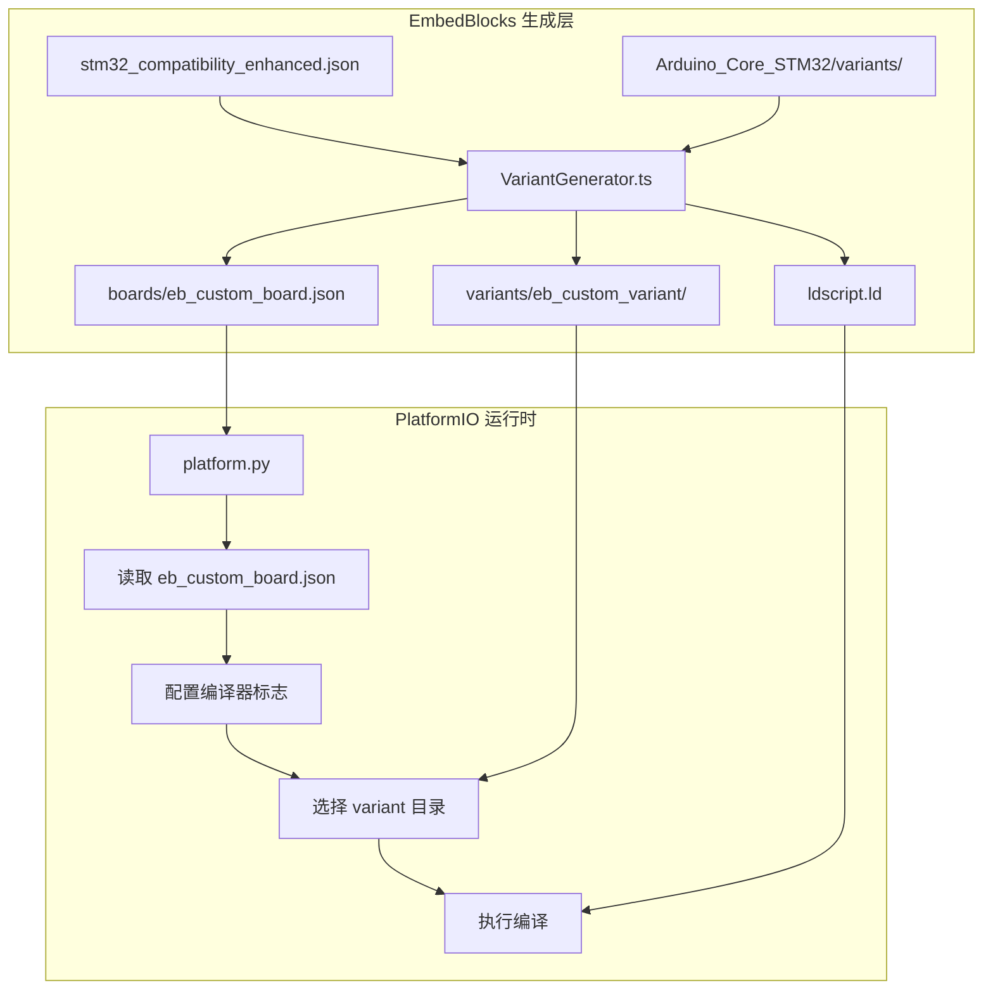

# 脚本目录指南 (Scripts Directory Guide)

本目录包含用于自动化生成 STM32 芯片数据、维护项目结构以及辅助构建的核心脚本。

---

## 🚀 快速开始

### `npm run sync:stm32` - 全量同步 (推荐)

```bash
npm run sync:stm32
```

**完整的数据同步流程：**

1. **Git 同步** - 同步三个上游仓库的最新数据：
   | 仓库 | 用途 | 同步方式 |
   |------|------|----------|
   | `ST_OPEN_PIN_DATA` | ST 官方引脚数据定义 | `git pull` |
   | `stm32-data-generated` | Embassy-rs 社区增强数据 | `git pull` |
   | `Arduino_Core_STM32` | STM32duino 核心（variants 源） | `submodule update` |

2. **运行 `npm run gen:stm32`** - 执行完整的数据生成流水线

> **使用场景**: 
> - STM32duino 发布新版本时
> - PlatformIO 更新板卡支持时
> - 需要将 EmbedBlocks 与上游数据源完全同步时

---

### `npm run gen:stm32` - 仅重新生成

```bash
npm run gen:stm32
```

**仅执行数据生成流水线**，不拉取上游仓库。

> **使用场景**:
> - 修改了脚本逻辑后需要测试
> - 本地已有最新仓库数据，只需重新生成

---

## ⚙️ 数据生成流水线

### 核心逻辑概览

我们现在的数据获取流程可以明确地总结为以下 5 步：

1.  **Git 同步**：脚本自动同步三个 Git 数据源（Embassy Data, Arduino Core, Open Pin Data）。
2.  **获取物理模型**：通过 `stm32-data-generated/data/chips` 获取所有拥有物理引脚定义的芯片型号。
3.  **获取支持列表**：通过 `Arduino_Core_STM32/variants` 扫描获取 STM32duino 原生支持的型号。
4.  **计算交集**：将【步骤 2】和【步骤 3】中的型号取交集，这就是 EmbedBlocks 最终支持的芯片列表。
5.  **生成数据文件**：为【步骤 4】中的每个型号创建一个独立的 `.json` 文件（例如 `STM32C011D6.json`），并通过读取 `stm32-data-generated`（获取引脚布局、规格）和 `Arduino_Core_STM32`（获取引脚映射、宏定义）中的具体内容来填充它。

---

### 技术实现细节 (Mermaid 流程)

```mermaid
flowchart TD
    subgraph S1 [第一阶段: 发现与过滤 (步骤 2,3,4)]
        SCRIPT_7A[7_parse_variants_PRE] --> REGistry[stm32duino_support_registry.json]
        A1[Embassy-rs Data] --> SCRIPT_1C[1c_discover]
        REGistry --> SCRIPT_1C
    end
    
    subgraph S2 [第二阶段: 数据提取 (步骤 5)]
        SCRIPT_1C --> DATA_BASIC[stm32_board_data.json]
        A2[Arduino_Core_STM32] --> SCRIPT_2[2_scan_pins]
        DATA_BASIC --> SCRIPT_2
        A3[ST Open Pin Data] --> SCRIPT_5[5_fetch_layouts]
        DATA_BASIC --> SCRIPT_5
        
        SCRIPT_2 --> DATA_DETAIL[detailed_board_data.json]
        SCRIPT_5 --> DATA_LAYOUT[stm32_layouts_cache.json]
    end
    
    subgraph S3 [第三阶段: 合成与映射 (步骤 5)]
        DATA_BASIC & DATA_DETAIL & DATA_LAYOUT --> SCRIPT_4[4_generate_data]
        SCRIPT_4 --> DATA_FINAL[src/data/boards/stm32/*.json]
        SCRIPT_4 --> MAP_COMPAT[stm32_compatibility_enhanced.json]
    end

    style SCRIPT_7A fill:#f9d,stroke:#333,stroke-width:2px
```

### 为什么脚本执行顺序是线性的？

经过 v1.4.0 的重构，我们消除了之前的循环依赖。现在的流程是严格单向的：

`7 (Pre-scan)` → `1c (Discover)` → `2 & 5 (Detail)` → `4 (Generate)`

*   **脚本 7**: 仅负责生成注册表（告诉后面的人“哪些能用”）。
*   **脚本 4**: 负责数据合成，并在最后一步基于已知的所有信息生成兼容性映射表（告诉 IDE “怎么编译”）。

因此，执行顺序精简为：**7 → 1c → 2 → 5 → 4**。

---

### 脚本详解

#### 1️⃣ `1c_discover_from_open_data.ts`

**功能**: 从 Embassy-rs 镜像的 STM32 Open Pin Data 发现所有逻辑型号

**输入**: `stm32-data-generated/data/chips/*.json`

**输出**: `scripts/stm32_board_data.json`

**过滤规则 (自动化白名单)**:
```typescript
// [核心增强] 动态白名单机制 (v1.3.0 优化)
// 1. 加载由脚本 7 生成的支持注册表
// 2. 采用【前缀模糊匹配】: 只要芯片 ID (如 stm32f103c8) 是 
//    Registry 中任何 MCU 条目 (如 stm32f103c8tx) 的前缀，即视为有效。

// 这种机制确保了只要更新了 Arduino_Core_STM32 仓库，
// EmbedBlocks 就能自动支持 STM32H5, U5, WBA 以及带特殊后缀的型号。
```

---

#### 2️⃣ `2_scan_stm32_pins.ts`

**功能**: 解析 Arduino_Core_STM32 的 C 源码，提取外设功能映射

**输入**: `Arduino_Core_STM32/variants/*/PeripheralPins.c`

**输出**: `scripts/detailed_board_data.json` (~11MB)

**提取内容**:
| 文件 | 数据 |
|------|------|
| `PeripheralPins.c` | ADC, PWM, SPI, I2C, UART 引脚映射 |
| `variant_generic.h` | 宏定义 (LED_BUILTIN 等) |
| `variant_generic.cpp` | Arduino 引脚索引 (D0, A0...) |

---

#### 3️⃣ `5_fetch_official_layouts.ts`

**功能**: 获取芯片物理布局数据，用于 Chip View 渲染

**输入**: ST Open Pin Data 的 XML 布局文件

**输出**: `scripts/out_scripts/stm32_layouts_cache.json` (~100MB)

> ⚠️ 首次运行需要较长时间 (解析大量 XML)

---

#### 4️⃣ `4_generate_stm32_data.ts`

**功能**: 合成最终板卡文件，融合所有数据源

**输入**:
- `stm32_board_data.json` (基础清单)
- `detailed_board_data.json` (外设映射)
- `stm32_layouts_cache.json` (物理布局)

**输出**: `src/data/boards/stm32/**/*.json` (1,430 个芯片)

**特性**:
- 将外设功能注入 `pinMap`
- 同步 Arduino 引脚索引到 `pin_options`
- **智能保留**: 重新生成时保留用户手工修改的 `description`

---

#### 5️⃣ `7_parse_stm32duino_variants.ts`

**功能**: 解析 STM32duino variants 目录，生成增强版兼容性映射

**输入**: `Arduino_Core_STM32/variants/*/boards_entry.txt`

**输出**: `electron/config/stm32_compatibility_enhanced.json`

**增强数据结构**:
```json
{
  "generic_stm32f103c8": {
    "pioBoardId": null,
    "variantPath": "STM32F1xx/F103C8(T-U)_F103CB(T-U)",
    "productLine": "STM32F103xB",
    "maxSize": 65536,
    "maxDataSize": 20480,
    "requiresLocalPatch": true
  }
}
```

> **所有芯片现在都使用 `local_patch` 模式**，从官方 STM32duino variant 复制文件，确保编译正确性。

---

## 📁 配置文件

| 文件 | 描述 |
|------|------|
| `data_sources.ts` | 外部仓库本地路径配置 |
| `global_sync_data.ts` | 同步流程主入口 (sync:stm32 调用) |

**`data_sources.ts` 示例**:
```typescript
export const ST_OPEN_PIN_DATA_PATH = 'G:\\Project\\STM32_DATA\\STM32_open_pin_data';
export const EMBASSY_STM32_DATA_PATH = 'G:\\Project\\STM32_DATA\\stm32-data-generated';
// 优先指向内置子模块 third_party/Arduino_Core_STM32
export const ARDUINO_CORE_STM32_PATH = '...'; 
```

---

## 🛠️ 辅助工具

| 脚本 | 描述 | 用法 |
|------|------|------|
| `maintain_boards.js` | JSON 格式化工具 | `node scripts/maintain_boards.js format` |
| `cleanup.js` | 开发环境进程清理 | 自动由 `predev` 调用 |
| `bundle_pio.ps1/.sh` | PlatformIO 打包脚本 | 发布前打包 |
| `sync_repos.ps1` | Git 仓库批量同步 | - |

---

## 📂 完整目录结构

```
scripts/
├── 1c_discover_from_open_data.ts    # [核心] 芯片发现
├── 2_scan_stm32_pins.ts             # [核心] 引脚扫描
├── 4_generate_stm32_data.ts         # [核心] 数据合成
├── 5_fetch_official_layouts.ts      # [核心] 布局获取
├── 7_parse_stm32duino_variants.ts   # [核心] 增强兼容性映射
├── data_sources.ts                  # [配置] 数据源路径
├── global_sync_data.ts              # [配置] 同步入口
├── maintain_boards.js               # [工具] JSON 格式化
├── cleanup.js                       # [工具] 进程清理
├── bundle_pio.ps1                   # [工具] PIO 打包 (Windows)
├── bundle_pio.sh                    # [工具] PIO 打包 (Linux/Mac)
├── sync_repos.ps1                   # [工具] Git 同步
├── deprecated/                      # 已废弃脚本
│   ├── verify_autodiscovery.ts          # (旧) 验证逻辑已集成至 1c
│   ├── 6_generate_compatibility_map.ts  # (旧) 近似匹配逻辑已废弃
│   └── ...
└── out_scripts/                     # 脚本输出缓存
    └── stm32_layouts_cache.json     # 布局缓存 (~100MB)
```

---

## ⚠️ 注意事项

### 中间产物 (已加入 .gitignore)

| 文件 | 大小 | 说明 |
|------|------|------|
| `stm32_board_data.json` | ~350KB | 芯片基础清单 |
| `detailed_board_data.json` | ~11MB | 外设映射详情 |
| `stm32_layouts_cache.json` | ~100MB | 物理布局缓存 |

这些文件可随时通过 `npm run gen:stm32` 重新生成。

### local_patch 模式

EmbedBlocks 现在统一使用 **local_patch 模式** 生成项目：

1. 从 `variantPath` 复制官方 STM32duino variant 文件
2. 使用 `productLine` 设置正确的编译宏
3. 使用 `maxSize/maxDataSize` 生成正确的链接脚本

这确保了：
- ✅ 正确的 HAL 宏定义
- ✅ 正确的启动代码
- ✅ 正确的链接脚本
- ✅ 精确的内存分区

---

## 📐 Local Patch 架构详解

### 与 PlatformIO 的关系

`eb_custom_board.json` 并**不是**由 PlatformIO 框架脚本生成的，而是由 EmbedBlocks 的 `VariantGenerator.ts` **自主生成**，但遵循 PlatformIO 期望的 JSON 格式规范。



### 职责划分

| 组件 | 职责 | 文件位置 |
|------|------|----------|
| **EmbedBlocks VariantGenerator** | 生成项目级板卡定义和 variant 文件 | `electron/services/VariantGenerator.ts` |
| **STM32duino variants** | 提供原始 variant 源文件 (复制使用) | `Arduino_Core_STM32/variants/` |
| **PlatformIO platform.py** | 运行时解析 board.json，配置编译环境 | `framework-arduinoststm32/tools/platformio/` |
| **GCC 工具链** | 实际编译和链接 | `toolchain-gccarmnoneeabi/` |

### 数据流详解

#### Step 1: 数据源准备 (npm run gen:stm32)

```
Arduino_Core_STM32/variants/*/boards_entry.txt
    ↓ 解析
7_parse_stm32duino_variants.ts
    ↓ 输出
electron/config/stm32_compatibility_enhanced.json
```

**stm32_compatibility_enhanced.json 结构**:
```json
{
  "generic_stm32f103c8": {
    "pioBoardId": null,                           // PIO 无官方支持
    "variantPath": "STM32F1xx/F103C8(T-U)_F103CB(T-U)",  // STM32duino variant 路径
    "productLine": "STM32F103xB",                 // HAL 设备宏
    "maxSize": 65536,                            // Flash 大小 (bytes)
    "maxDataSize": 20480,                        // RAM 大小 (bytes)
    "requiresLocalPatch": true                   // 需要 local_patch
  }
}
```

#### Step 2: 项目创建时 (用户点击"新建项目")

```
ProjectService.createProject()
    ↓ 检测 requiresLocalPatch
VariantGenerator.generatePatch()
    ↓ 生成
boards/eb_custom_board.json     ← 板卡定义
variants/eb_custom_variant/     ← variant 文件 (复制+生成)
    ├── variant_generic.h/cpp   ← 从 STM32duino 复制
    ├── PeripheralPins.c        ← 从 STM32duino 复制
    ├── ldscript.ld             ← EmbedBlocks 生成
    └── variant_EB_CUSTOM_BOARD.h ← EmbedBlocks 生成
```

#### Step 3: 编译时 (用户点击"编译")

```
platformio run
    ↓ 加载
platform.py (PlatformIO 框架脚本)
    ↓ 解析
boards/eb_custom_board.json
    ↓ 提取配置
build.extra_flags: "-DSTM32F103xB -DARDUINO_GENERIC_F103C8TX"
build.variant: "eb_custom_variant"
build.ldscript: "ldscript.ld"
    ↓ 执行编译
arm-none-eabi-gcc ...
    ↓ 链接
arm-none-eabi-ld -T ldscript.ld ...
    ↓ 输出
firmware.bin / firmware.elf
```

### eb_custom_board.json 字段来源详解

| 字段 | 生成者 | 数据来源 | 用途 |
|------|--------|----------|------|
| `build.core` | VariantGenerator | 固定值 `"stm32"` | PlatformIO 框架选择 |
| `build.cpu` | VariantGenerator | 根据 MCU 系列推断 | GCC 编译器目标 (-mcpu=) |
| `build.extra_flags` | VariantGenerator | `inferProductLine()` + `generateArduinoBoardMacro()` | 预处理器宏定义 |
| `build.f_cpu` | VariantGenerator | 芯片数据或默认 72MHz | 系统时钟配置 |
| `build.mcu` | VariantGenerator | 芯片数据 (小写) | GCC 芯片型号 |
| `build.product_line` | VariantGenerator | `stm32_compatibility_enhanced.json` | STM32 HAL 头文件选择 |
| `build.variant` | VariantGenerator | 固定值 `"eb_custom_variant"` | variant 目录名 |
| `build.ldscript` | VariantGenerator | 固定值 `"ldscript.ld"` | 链接脚本路径 |
| `upload.maximum_size` | VariantGenerator | `stm32_compatibility_enhanced.json.maxSize` | Flash 大小检查 |
| `upload.maximum_ram_size` | VariantGenerator | `stm32_compatibility_enhanced.json.maxDataSize` | RAM 大小检查 |
| `upload.protocol` | VariantGenerator | 默认 `"stlink"` 或继承 | 上传协议 |
| `name` | VariantGenerator | 动态拼接 | PlatformIO 显示名称 |
| `url` | VariantGenerator | 固定 ST 官网链接 | PlatformIO 必需字段 |
| `vendor` | VariantGenerator | 固定 `"ST"` | PlatformIO 必需字段 |
| `frameworks` | VariantGenerator | 固定数组 | 支持的框架列表 |

### PlatformIO 框架脚本不做的事

PlatformIO 的 `framework-arduinoststm32/tools/platformio/` 脚本**只负责**：
- 读取已存在的 board.json
- 配置编译器选项
- 处理 variant 路径
- 执行编译命令

它**不会**：
- ❌ 生成 board.json 文件
- ❌ 创建 variant 文件
- ❌ 生成链接脚本

这些工作全部由 EmbedBlocks 的 `VariantGenerator.ts` 完成。

### 为什么需要 local_patch 模式？

1. **覆盖范围有限**: PlatformIO 官方只支持约 150 款 STM32 板卡，但 STM32duino 支持 2000+ 款芯片
2. **官方板卡不适用**: 很多芯片虽然在 PlatformIO 有板卡，但内存大小/引脚配置可能不同
3. **完全控制**: local_patch 让 EmbedBlocks 完全控制 Flash/RAM 配置，确保编译正确

#### 生成的文件结构

```
MyProject/
├── boards/
│   └── eb_custom_board.json      # 自定义板卡定义
├── variants/
│   └── eb_custom_variant/
│       ├── variant_generic.h     # 从 STM32duino 复制
│       ├── variant_generic.cpp   # 从 STM32duino 复制
│       ├── PeripheralPins.c      # 从 STM32duino 复制
│       ├── ldscript.ld           # 自动生成 (内存配置)
│       └── variant_EB_CUSTOM_BOARD.h  # 包装头文件
├── platformio.ini
└── src/
    └── main.cpp
```

#### eb_custom_board.json 结构

| 字段 | 来源 | 说明 |
|------|------|------|
| `build.extra_flags` | 动态生成 | `-D{productLine} -D{arduinoBoardMacro}` |
| `build.product_line` | `stm32_compatibility_enhanced.json` | HAL 设备选择宏 |
| `build.ldscript` | 固定 | `ldscript.ld` |
| `build.variant` | 固定 | `eb_custom_variant` |
| `upload.maximum_size` | `stm32_compatibility_enhanced.json` | Flash 大小 (bytes) |
| `upload.maximum_ram_size` | `stm32_compatibility_enhanced.json` | RAM 大小 (bytes) |
| `name` | 动态生成 | `EmbedBlocks Custom ({chipName})` |
| `url` | 固定 | ST 官网链接 |
| `vendor` | 固定 | `ST` |

#### extra_flags 组成

```
extra_flags = -D{productLine} -D{arduinoBoardMacro}
```

| 宏 | 示例 | 用途 |
|----|------|------|
| productLine | `STM32F103xB` | STM32 HAL 设备选择 (stm32f1xx.h requires) |
| arduinoBoardMacro | `ARDUINO_GENERIC_F103C8TX` | variant_generic.cpp 条件编译 |

#### ldscript.ld 关键符号

| 符号 | 计算方式 | 用途 |
|------|----------|------|
| `_estack` | `0x20000000 + RAM_SIZE` | 堆栈顶端地址 |
| `_Min_Heap_Size` | `0x200` (512 bytes) | 最小堆大小 |
| `_Min_Stack_Size` | `0x400` (1024 bytes) | 最小栈大小 |

---

### 日常开发

除非以下情况，否则**不需要**运行 `npm run gen:stm32`：
- 修改了生成脚本的逻辑
- 需要同步官方最新芯片数据
- STM32duino/PlatformIO 发布了新版本

---

## 🔧 VariantGenerator 核心方法

| 方法 | 作用 |
|------|------|
| `generatePatch()` | 入口方法，协调整个生成流程 |
| `generateBoardJson()` | 生成 `boards/eb_custom_board.json` |
| `copyExistingVariant()` | 复制官方 STM32duino variant 文件 |
| `generateLdScript()` | 生成链接脚本 |
| `generateVariantWrapperHeader()` | 生成 `variant_EB_CUSTOM_BOARD.h` 包装 |
| `inferProductLine()` | 推断 HAL product_line (如 STM32F103xB) |
| `generateArduinoBoardMacro()` | 生成 Arduino 板卡宏 (如 ARDUINO_GENERIC_F103C8TX) |

